摘要：⼀个纯粹的p2p版本的电⼦现⾦(cash)货币允许在线⽀付能够让⼀⽅直接发送到另⼀⽅⽽不通过⼀个⾦融机构。数字签名提供的这个场景的部分解决⽅案，但是如果在⾯对阻⽌双重⽀付(双花)的场景下仍然需要⼀个信任的第三⽅那么现有的⽅案仍然是缺少主要利益(不够好)的。这个⽹络加盖时间戳到交易上通过对这些交易做hash变为⼀个持续增⻓的基于随机算列的(hash-based)的⼯作量证明(pow)的链上。最⻓的的链不⽌提供证明对被观察的发⽣的事件顺序，并且提供证明这条链来⾃最⼤的CPU计算⼒的池。只要主要的CPU算⼒是不被那些有攻击⽹络性质的节点所控制，他们会成⻓为最⻓的链并超过那些攻击者。这个⽹络⾃身只需要很⼩的结构。信息被最有效率的⽅式⼴播，并且节点可随时离开或加⼊⽹络，这些节点接受最⻓的Pow链作为他们(节点)离开⽹络后发⽣事情的证明。


> 摘要指出，现有的技术让p2p的发送⼀个交易是可靠的，⽅法是通过数字签名的⽅法，这⾥暗含指出⽐特币在这个⽅⾯使⽤的也是数字签名的⽅式保证交易传递。但是随后就指出，数字签名的是⽆法解决双重⽀付的，因为数字签只能保证这个东⻄是属于发送⽅的，但是没有办法保证这个东⻄发给⼀个⼈以后不会再发给其他⼈，因为数据是可以复制的。现有的⽅案就是发送⽅和接收⽅都信任⼀个第三⽅作为中介。由这个第三⽅记录A有⼀个东⻄，并把这个东⻄给了B完成了⼀笔交易。也就是这个第三⽅具有绝对上帝的权利，⽽A和B都是因为“信任着”这个第三⽅交易才能成⽴。之后给了区块链系统⼀个很⼤概的介绍，其中指出区块链的⼏个关键点：时间戳，hash作为标识，使⽤hash的⼯作量证明，链在⼀起。提供发⽣事件的顺序表明区块是“记录历史的”，链来⾃最⼤CPU算⼒是说明其在CPU算⼒证明的规则下是唯⼀的，不可被颠覆的。最后说明区块链的结构精简，节点灵活，暗含这是⼀个多节点智能共同协作的智能系统。(就是虽然每个节点智能有限，但是所有节点都遵从⼀套简单的规则，则整个系统能体现出巨⼤的⼒量) 1.介绍现在internet上的贸易绝⼤多数都要依靠⼀个⾦融机构提供第三⽅信任来处理电⼦⽀付。尽管这个系统对多数交易都⼯作的很好，但是它依然⾯对与⽣俱来的基于信任模型的缺陷。完全的不可逆交易不是真正可能的，因为⾦融机构不能避免纠纷协调处理。协调调解的成本增加了交易的成本，限制了最⼩的实际交易规模并且切断了⼩型临时交易的可能。并且在对不可逆服务进⾏不可逆付款的弱项⽅⾯存在更⼤的成本。因为存在撤销的可能性，对信任的需要就被分散了。商户需要对他们的客户提⾼警惕，所以收集他们⽐起需要的更多信息。⼀定⽐率的欺诈被视为是可能的。这种成本和不确定的交易是可被避免的当⼀个⼈是通过现实现⾦交易的⽅式，但是没有⼀个存在的机制来确保交易是通过⼀个没有可信⽅的通信通道进⾏⽀付的。> 这段体现出区块链是为了解决信任问题，因为第三⽅机构的存在，信任问题是⼀种天然存在的问题。现有的机制在维护这种信任会付出很⼤的成本。另⼀⽅⾯区块链体现出不可逆和不可篡改性，并指出这两个特性是区块链天然具有的。准确的来说这⾥体现出来就是区块链出现的颠覆性理由。回顾⽬前为⽌的科技发展，由计算机引领了第三次信息⾰命，使得信息能够在⽹络中快速流动。但是互联⽹虽然能够使信息快速流动，但是却没法实现类似现实世界中的物质转移。因为信息是虚拟的，但是现实中的物质是实实在在的实体。正是因为互联⽹中是虚拟的，所以如果在⼀个虚拟的世界中模拟⼀个物体，就可以⽆限制的复制这个物体，但是同时是没法模拟现实中的物质转移的。举例来说就是假设A要给B⼀个物品，那么在现实世界中是实实在在的物品转移，⽽在虚拟世界中就是⼀条消息记录，⽽这条消息记录是由A记录，还是由B记录，还是由⼀个第三⽅记录呢？显然不管是A记录还是B记录都不可能让A和B都同时认同，因为他们都可以私⾃更改这个记录⽽违约，所以就会找⼀个第三⽅来做担保(如公证处，中介等)，A和B都把⾃⼰的信任交给了这个第三⽅机构做担保，所以整个体系才能共运作起来。所以⽬前对这样的模拟都是引⼊了第三⽅可信机构，⼈们把信任交给这个第三⽅，并相信由这个第三⽅保证模拟物品的唯⼀性和转移(不可复制)。⽽这个第三⽅是否真的可信，就是现在运⾏这套体系所付出的成本。这是⽬前这套体系的“天然缺陷”。
> 所以如果想要使⽤互联⽹来模拟现实中的物质转移，使现实中的物品和虚拟世界中的物品挂钩，⽽不需要⼀个第三⽅作为这个转移的担保，那么就需要引⼊区块链机制。区块链可以让物质的转移像信息流动⼀样快速便捷，同时⼜由全⽹的⼈⼀起来担保(全部参与的⼈⼀起担保就相当于天然存在存在不可证伪，除⾮其中51%的⼈统⼀⼝径违约)，来保证在虚拟世界中的物质转移的可靠。我认为这就是“区块链”技术有望成为引领“第四次技术⾰命”的核⼼原因。


现在需要的就是⼀个电⼦⽀付系统基于密码学加密证明来替代信任，允许任何两⽅能够直接交易在不需要⼀个可信的第三⽅的场景下。计算上保证的不可逆交易将会保护卖⽅免受欺诈，并且常规的托管机制可以很容易的被实现来保护买⽅。在这篇论⽂⾥，我们提出⼀种⽅案来解决两次⽀付问题使⽤⼀种p2p分布式的时间戳服务来⽣成交易的时间顺序的计算证明。整个系统是安全的只要诚实节点⽐合作攻击的节点控制了更多的CPU计算⼒。

> 这⾥指出，实际上信任问题是由原来的国家强制⼒(银⾏)，企业⼤⼩(微信，⽀付宝)这种感觉或者其他的信任转移到了“密码学加密”的数学体系上，变为了是否相信数学是可靠的问题。但是后⼀句的语⾔表达上实际上暗含了区块链这个体系实际上是⽀付⽅⽐接收⽅更具备⼀点优势，不是绝对平等的地位，所以接收⽅需要担⼼⽀付⽅的攻击(⼆次⽀付)。最后说明，区块链解决两重⽀付，基础的拓扑结构是p2p，时间戳是确认交易顺序的⽅式。


## 2.交易(Transaction)

我们定义⼀枚电⼦币(electronic coin)作为⼀个数字签名链(as a chain of digital signatures)。每⼀个拥有者(owner)交易货币(coin)给下⼀个⼈通过数字签署(私钥签署) 上⼀个交易和下⼀个⼈的公钥 的hash并且把这个签署的结果附加在了这个货币的末尾。⼀个收款⼈可以验证这个签名来确保这个链的所有权(chain of ownership)

> 这段话在原⽂表述的过程中直观来说有点反直觉。因为在第⼀句话原⽂是We define anelectronic coin as a chain of digital signatures，也就是说define coin as chain。这是⼀个很奇怪的东⻄，因为直观来说，coin应该是⼀个⼀个的，但是chain是⼀个链条，很难把coin和chain联系在⼀起。但是⽐特币本质上确实就是⼀个链条，这个链是由⼀条⼀条交易按照发⽣的顺序组成的，⽽coin反⽽是不存在的，coin是由链条上的交易(transaction)推算出来的，本身并没有直接的coin出现。同时这⾥看到，根据前⽂的描述，把⼀个coin给下⼀个⼈是通过数字签名的⽅式，也就是说通过公私钥的⽅式证明coin的来源与去处。假设现在A要给B⼀个coin，那么这个过程成为⼀个交易(transaction)(⽐如下图中的中间那个Tx)，这个交易记录给B多少coin，和B的公钥(指明⽬的地)，同时提供A可以操作上⼀个交易(如图中的第⼀个Tx。⽐如这个Tx记录的是X给了A⼀笔钱，那么相当于A可以操作X给A的这个交易的输出)，对这两个共同hash后，付款者A⽤⾃⼰的私钥签署这个hash，然后加在交易的上⾯。之后这个交易被⼴泛地⼴播道其他地⽅。此时作为⼀个旁观者(矿⼯)，是在⾃⼰本地具有第⼀个交易之前的所有交易的，所以看到这个交易(中间这个Tx)的时候，就可以⽤付款者A的公钥(指代的是图中第⼀个交易，A的公钥从第⼀个交易中获得)去验证这个交易(中间这个交易)的签名以证实这个交易是不是由付款者A本⼈发出的(因为私钥只有A持有，只有⽤A的私钥进⾏签署的签名才能和上⼀个交易(第⼀个交易)进⾏验证通过，证明A可以操作第⼀个交易，具备这笔从X转到A的钱)。这样就证明了这个交易是由付款⼈A发起的。

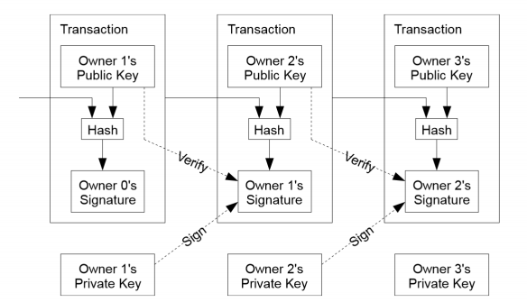

> 我们来以中间那个Tx(交易)作为参照物。这个Tx是由Owner 1发起的，由图中可以看出，hash的input是上⼀个Tx(prev Tx)和下⼀个接收者的公钥(next owner's pub key)，这hash的结果被Owner 1的私钥进⾏签署，并附加在了当前的这个交易上。⽬前不要和下⼀个Tx连起来看，当Owner1签署完这个Tx后，Ta把这个交易⼴播出去，则⼀旦有矿⼯(miner)将这个交易打包进⼊区块并链在诚实链(最⻓的链)上，则表示这个Tx是成⽴的。所以可以看出此时Owner2是不会像正常交易那样⽴即知道有没有成功的，⽽是需要过段时间去"查看"(这⾥是很朴素的说法，也可表示有个东⻄去轮询，只要交易被打包了就通知Owner2)这笔交易有没有被打包，是的话就代表交易成功了。


这个过程的问题是收款⼈不能验证付款⼈中(one of the owners)没有双重⽀付货币。⼀个通常的解决⽅案是引⼊⼀个可信的中央认证，或铸币⼚(mint)，来对每⼀笔交易检查是否被双重⽀付。在每⼀笔交易后，这个货币必须被返回到铸币场(mint)来发⾏⼀个新的货币(coin)，并且只有货币被直接的从可信的铸币⼚发⾏才能保证不被双重⽀付。这个解决⽅案的问题是全部货币(money)的命运都依靠在这个公司运作的铸币⼚(mint)上，每⼀笔交易都必须通过他们，就像⼀个银⾏⼀样。

> 这⾥的铸币⼚⼀开始很难理解是什么意思，其实这个是个很简单的现象，只是这个过程实在是太朴素了以⾄于没⼈注意到现在的体系就是这样运作了。⽐如现在的⽹上银⾏(或者⽀付宝)，当A给 B转账100块钱，实际上是银⾏开启了⼀个事物(transaction)，让A的账户上-100块，然后让B的账户上+100块。这个-100块和+100块实际上就是银⾏这个“铸币⼚”，销毁了A的100块钱，然后⼜⽣产了100块钱给了B(只不过整个流程都只是体现在信息的流动上)。正因为如此，所以才要保证这个“货币”只能从这个“铸币⼚”(银⾏)发⾏，并且这个“铸币⼚”被双⽅都共同信任，每⼀笔交易都“必 须”通过这个“铸币⼚”⽽没有其他途径。现有的体系也正是由银⾏"铸币⼚"(唯⼀信任⽅)来保证A的账户-100的同时只有B的账户+100⽽不会同时C的账户也+100(双重⽀付)。(当然要是银⾏有内⻤和A暗地沟通，当A转账给B 100块的同时给C也加上了100块，就发⽣了双重⽀付了。当然现在看起来是不会发⽣的，这是因为银⾏⾃身的“监督”体制保证的，如每天的对账，银⾏内部的监管等等。⽽这些监督的代价，就是维护这个体系的成本)另⼀⽅⾯，之所以银⾏能知道⼀笔钱是否被双重花费了，是因为这个银⾏具备了当前交易之前的所有的“历史交易”，它验证⼀个交易是否合法的⽅式就是去检查之前的所有交易的结果是否满⾜当前这笔交易的要求。

我们需要给收款⼈(payee)⼀个⽅法去知道之前的拥有者们(owners)没有签署过更早的交易。对于这个⽬的，最早(earliest)的交易才是重要的，所以我们不必关⼼后⾯的交易是否尝试去双重⽀付。唯⼀的确保⼀个交易存在性的⽅法就是拥有查询所有的交易。在基于铸币⼚模型中，这个铸币⼚拥有所有的交易并且决定哪⼀个交易最新到达(which arrived first)。为了在没有⼀个可信任⽅的情况下完成这件事情，交易必须被公共公告，并且我们需要⼀个系统让所有参与者对只对在⼀个单链顺序历史(which they werereceived)上达成共识。收款⼈需要证明在每⼀次交易的期间，⼤多数节点都同意这是他们第⼀次收到的(was the firstreceived)。

> 这⾥指出⾸先是付款⼈才会发⽣双重⽀付，⽽收款⼈是担⼼付款⼈会不会⼲这件事情(废话，因为利益是由付款⼈转移到收款⼈上的)。“最早的交易才是重要的”这句话是说，双重⽀付发⽣的基础是，⾸先要已经发⽣过⼀个交易，然后付款⼈想⽆视这笔交易，再次使⽤这个交易已经⽤过的货币发起另⼀次交易。所以这个最早的交易指代的是“已经发⽣过的交易”。铸币⼚并不关⼼想要发起双重⽀付的⼈的两笔(或以上)的交易哪笔是这个付款⽅认为先发⽣的，他只关⼼此刻这个付款⽅发起的这个交易是否“合法”(也就是之前这个⼈有没有已经⽤过这笔钱了)。所以是铸币⼚确认哪个交易在前，⽽不是由付款⼈决定哪个在前的。那么此时的这个铸币⼚并不归属任何⼀个第三⽅，那么这个交易就必须被“⼴⽽告之”，让所有参与进来的⼈都知道这件事情发⽣了，并且所有⼈都知道以前发⽣的所有“历史事件”来验证此时被⼴播的这个交易是否是合法的。但是我们知道，要让所有参与的⼈都保持⼀致是⼀件相当相当困难的事情，这也就是区块链所解决的问题。⽽最后⼀句话就是说收款⼈需要⼤多数⼈(超过51%)都认为那个交易是合法的了，那么才能说明这个交易是合法的。


## 3.时间戳服务器(Timestamp Server)

我们建议的解决⽅案从时间戳服务器开始。⼀个时间戳服务器的⼯作是通过把⼀组数据(items)形成的区块(blocks)的hash结果(taking a hash)加盖上时间戳(to be timestamped)并⼴泛的⼴播(publishing)这 个hash，就像在报纸或者世界性新闻组⽹络(Usenet)的发帖⼀样[2-5]。这个时间戳证明在那个时间这个数据⼀定是存在的，明显的，要得到这个hash(就只能在这个时间)(inorder to get into the hash)。每⼀个时间戳包含了上⼀个时间戳在它的hash中(includes the previous timestamp in itshash)，形成了⼀个链条，随着每个新增的时间戳都加强(reinforcing)了这个新增之前的所有时间戳。

> 从这部分开始说明的就是矿⼯(miner)所⼲的⼯作。这⾥的⼀组数据就是指很多笔交易，然后把这⼀组数据打包成了⼀个区块(block)，并把这个区块加盖上时间戳并做hash，以此来保证时间的先后顺序，也就是要完成第2部分所介绍的“确保历史顺序”。⽽因为要得到这个hash是和当时的时间戳联系在⼀起的，所以这个hash就标识着时间了。因为这些区块是形成⼀个链条的，⽽区块的增⻓是CPU算⼒的证明(后⽂会描述)，所以因为hash->体现了时间戳->hash被链在⼀起->链上⼀个新的区块需要耗费CPU->所以之前的hash就⼀定是正确的(不断被加强可信度)。

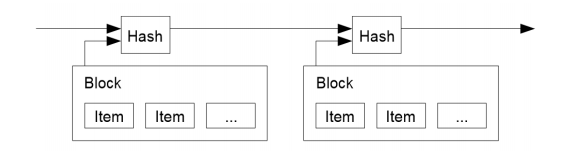

> 这个图就是为了说明时间和区块挂钩，区块和hash挂钩，和这些hash因为区块链的性质连在⼀起，所以之前挂钩的时间戳是不可被篡改的。

## 4.⼯作量证明(Proof of Work) 

为了实现⼀个基于p2p的分布式时间戳服务器，我们将会需要使⽤⼀个类似于Adam Back'sHashcash[6]的⼯作量证明系统，⽽不是使⽤报纸或者世界新闻⽹络组。⼯作量证明机制引⼊对⼀个值的扫描(scan)在hash的时候，例如在SHA-256下，这个hash从⼀串0bits开始。需要的平均⼯作是所需0bit数的指数，并且可以通过执⾏单个hash来被验证。

> 该部分就是bitcoin区块链的另⼀个核⼼部分，就是⼴泛被⼈所知的PoW。在前⾯章节提到过⾸先A与B发⽣了⼀笔交易，然后这笔交易被⼴播，由于没有第三⽅，所以参与的⼈就是全⽹的所有节点。这些节点在收到这个交易和其他好多交易后，打包成为⼀个区块并加盖上了hash。那么现在的问题就来了，如果这些旁观的矿⼯都分别收到了很多交易消息并打包出了⾃⼰的区块，那么怎么保证全⽹达成共识呢？也就是假设C，D，E三个矿⼯都收到交易消息了，然后因为他们收到的交易消息不完全⼀致，收到的时间也不完全⼀致，那么产⽣的区块的hash肯定天差万别，有p2p经验的⼈都知道此时就需要保证C，D，E三个⼈最后需要达成共识，这样才能保证整个⽹络都认同同⼀个区块链所发⽣的“历史事件的顺序”，否则整个体系将会毫⽆⽤处。⽽中本聪在这⾥的⽅式就是引⼊了POW来让C，D，E三个⼈⽤付出”CPU算⼒“的途径去以概率性成功的⽅法去抢夺记录区块的权利(也就是俗称的”记账权“)。原⽂中的scan就是指暴⼒枚举。因为对于SHA-256来说，以⽬前的密码学来说，要达到某个符合的条件，只有进⾏暴⼒枚举的⽅式去获得，显然，”暴⼒“的快慢，是由CPU的计算能⼒决定的，⽽要暴⼒的规模，就是这个POW机制的”难度“。因为要枚举出这个值是以”概率性“的事件(想象⼀下去猜测⼀个不知道密码的压缩⽂件会怎么暴⼒破解)，但是因为要经过相当多次枚举，最后平均下来，得到的结果确实可衡量的(也就是概率的期望值，在有些矿池把这个近似的叫幸运值？不太确定)。


对于我们的时间戳⽹络，我们实现这个⼯作量证明通过在区块中增加⼀个nonce，直到⼀个给出块的hash所需要的0-bits值(位数)被找到。⼀旦CPU效率被花费来作为⼯作量证明，这个区块不能再被改变去重做相应的⼯作。之后区块被链在它之后，要改变这个区块说需要的⼯作将会包含这个块之后所有块所需要的⼯作量。

> 对于这个区块”猜测“得到的那个满⾜要求的值的⽅式就是改变这⾥的nonce。(因为对于散列函数来说，只要做⼀点⼩的改动，结果就会完全不同。获得满⾜要求值得⽅式就是不断变换nonce使得整个区块的hash满⾜难度要求)所以这个nonce就代表了当前这矿⼯，为了夺取到这⼀轮区块的”记账权“，所付出的劳动(CPU算⼒，电费)的”证明“。所以可以直接把nonce看作是”劳动(⼯作量)的证明“。⽽后半部分是说明，假如区块中有更改，那么这个hash就被更改了，那么就需要重新计算这个区块的nonce，也就是要改变前⾯的区块，那么你要把要改的这个区块⼀直到⽬前这轮所需要的区块全部都计算过来(付出需要的全部劳动)才可做到。

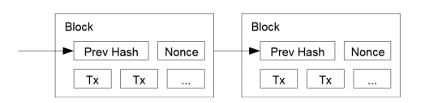

> 这个图实际上和上⼀个图⼀样，只是这⾥着重体现出每个区块的内容，指明⼀个区块是包含上⼀个hash的(Prev Hash)，并且Nonce是区块中的⼀个部分。⼀旦更改Nonce，Prev Hash, Tx其中任意⼀个，那么这个区块的Hash也会改变，之后的区块也全部都要改。

⼯作量证明同时解决了多数决策中决定代表的问题。如果⼤多数⼈只根据⼀⼈⼀ip进⾏投票(one-IP￾one_vote)，这样会被任何能够分配很多ip的⼈破坏。⼯作量证明本质上是⼀CPU⼀票(one-CPU-one￾vote)。主要的(⼤多数)的决定是由最⻓的链所代表，最⻓链拥有最⼤的⼯作量花费在其中。如果⼀个⼤多数CPU算⼒都被诚实节点所控制，那么最诚实的链就会增⻓的最快且超过其他任何计算链。想要改变⼀个过去的区块，攻击者需要重做这个区块和所有在这个块后的区块的⼯作量证明，之后还要追赶上并超过现在所有诚实节点的⼯作。我们之后会展示，⼀个慢速的攻击者能够追赶上(catching up)的可能性将会指数级的减少，但后续的块被添加时。

> 这段补充说到PoW实际上就是共同决策选择代表的问题，等价于抢夺记账权问题，因为抢到了记账权，就是选出了代表。这⾥附加上说到为什么中本聪没有考虑使⽤IP作为决策的原因，是因为他认为IP作为投票权⽐CPU作为投票权容易的多(是否是最好的选择不知道，但是⽬前看来是最好的，不过现在的CPU投票权都被”矿池“所把控，⼀定程度上产⽣了动摇性(但仍然⽐控制IP好的多)，当然也有⼀些矿池公开宣布⾃⼰的算⼒不超过⼀个值以维持整个体系的稳定(找到这个新闻我就补充上链接))。随后⽂章再次强调，想要更改区块，那么攻击者将要付出极⼤的代价，⽽诚实的链因为是规则所倡导的，会在博弈中⾃然的变为最⻓的链(后⽂将会描述)。

为了补偿不断增⻓的硬件速度和随着时间推移不断变化兴趣的运⾏节点(vrayinginterest)，⼯作量的困难度是由⼀个移动的平均⽬标决定，就是每⼀个⼩时的平均区块(就是这个平均⽬标)。如果这些计算⼒增⻓的太快，这个困难度就会增加。

> 这⾥指出这PoW的难度是随整个系统的难度⽽⼀起提升的，因为计算机计算的硬件能⼒是不断提升的，想想现在的CPU挖矿->显卡挖矿->矿机挖矿，这就是PoW的精妙之处。但是这同样也带来了⼀个对bitcoin不看好的⼀个理由：现在的计算机算⼒因为参与的⼈太多，⽽难度提升的很⼤，整体的算⼒也⽔涨船⾼，近年更是呈指数增⻓。那么要是过了若⼲年后，bitcoin的激励(后⽂提到)所产⽣的效果不能承受这么⾼算⼒的代价，是否会造成算⼒的断崖式下跌？随之带来的是bitcoin信⽤的崩溃(能够被掌控算⼒的⼈攻击)⽽导致bitcoin最后突然崩盘？


## 5.⽹络(Network) 

运⾏这个⽹络的步骤如下：

1. 新的交易被⼴播到全部的节点。
2. 每⼀个节点把新的交易收集进⼊到⼀个区块
3. 每⼀个节点都为⾃⼰的那块区块进⾏⼯作去找到那个⼯作量证明
4. 当⼀个节点找到了这个块的⼯作量证明，它把这个块⼴播给所有的节点
5. 节点们只能当这个区块中的所有的交易都是合法的并且都没有被花费过才会接受这个块
6. 节点们通过转向下⼀个块的⼯作量证明并使⽤这个块的hash作为(下⼀个块的)前⼀个hash来表示接收这块。


节点们总是只考虑最⻓的链是正确的并且不断为扩展它进⾏⼯作。如果2个节点同时⼴播不同版本的下⼀个块，⼀些节点会⾸先收到其中⼀个块，在这种情况下，他们为收到第⼀个块⽽⼯作，不过另⼀块保存下来以防它会变得更⻓。这个平衡(tie)将会被打破当下⼀个⼯作量证明被发现的时候并且这个时候⼀条分⽀会变得更⻓。在其他分⽀⼯作的节点们将会转换到这个最⻓的分⽀上。

> 这段实际暗含了bitcoin的”最⼤规则“，也就是所有⼈都默认最⻓链是正确的。如果这条不能保证，那么可想⽽知整个系统是不能⼯作的。⽽这个最⻓链是正确的是由后⽂的”激励机制“所保证的，所以这⾥就出现了⼀个博弈场景：如果现在要创建⼀个区块链应⽤，那么要么要所有⼈能够公认⼀个规则(强制⼒)，那么要⽤某些⽅法使⼈们能够⾃主的认同⼀个规则(激励)，但是总之因为争夺区块是要产⽣代价的，如何在对这个代价进⾏”强制⼒/激励“进⾏博弈，就是⼀个区块链是否能健康成⻓的关键。后半部说明⼀个区块真正能够被承认的关键：有矿⼯(⼤部分)以这个区块为prev区块，并为它构成的hash纳⼊新的⼀个区块并为新的区块⼯作，那么这个区块才是被承认的。所以这⾥指明，只有产⽣的下⼀个区块，当前的这个区块才是”合法的“。这条相当关键，因为所有的攻击都会指向这个问题，同时收款者与付款者的不平衡点也是这⾥所导致。同时这⾥也是区块链运⽤博弈论的精华体现。后半部说明⼀种特殊情况，就是说因为分布式⽹络的特点，信息沟通不是实时性的，所以会出现⼀些节点认可⼀个区块⽽另⼀些节点认可另⼀个区块⽽造成了区块链的分叉问题，但是这⾥解释了因为所有节点都认为只以最⻓的链为唯⼀链，所以这种情况会在多链⼏个区块后被打破，发⽣区块重组。

新交易的⼴播到所有的节点上是不必要的。只要交易到达了许多节点上，它们就会进⼊到⼀个区块中(在最⻓的区块中(beforelong))。区块⼴播是有容忍丢失信息的能⼒的。如果⼀个节点没有收到⼀个块，它就会在收到下⼀个块的时候发现缺失了它并请求这个丢失的块。

> 这段是对上段的⼀个补充，说明了51%(⼤多数)的重要性，这个⼤多数并不会以⼀个直观的数字体现，⽽是因为所有⼈都认可最⻓链，随着时间的迭代⽽慢慢迭代出来。同时这⾥提到⼀个关键的地⽅是：“新交易的⼴播到所有节点是不必要的”，这⾥旗帜鲜明地表明⽩了交易是不需要泛洪的。因为想扩散交易本身的信息，在区块链系统中可以不⽌扩散交易，还扩散区块。⽽区块被扩散是系统中的“规则”(达到最⻓链)。我认为这可以带来分布式系统中的⼀些新的思考。


## 6.激励机制(Incentive)

按照惯例(进⾏约定)，⼀个块中的第⼀个交易是⼀个特殊交易，它由这个块的创造者拥有⼀个新货币起始。这样提供了⼀种激励机制让节点们能够⽀撑这个⽹络，并且提供了⼀个⽅式来初始化的分发货币进⼊整个系统当中。因为没有⼀个中央授权机构来发布他们(货币)。稳定增加⼀定数量的新货币类似于⻩⾦矿⼯花费资源开采⻩⾦并引⼊循环系统当中。在我们的情境下，CPU时间和电⼒就是被花费的。

> 这段终于说明前⾯⼀直回避的⼀个问题：货币从哪来？在bitcoin的系统中，中本聪已经规定了总量就是2100W个bitcoin。⽽这些bitcoin的产⽣是每产⽣21000个区块就减半(以现在约定⼤约每10分钟产⽣⼀个区块的速度⼤约到2140年产⽣为0)。⽽bitcoin产⽣的⽅法就是给抢到记账权的⼈凭空给予⼀定量的货币，这样就同时解决的货币发⾏和矿⼯记账的奖励(就像现实中挖⻩⾦的⻩⾦矿⼯⼀样)。这这种凭空奖励的⽅法，就是每个区块的第⼀交易，是⼀个特殊的交易，这个交易就是只有Input，且对于输⼊这个input的output(前⼀个交易的output)是个空(后⽂会提到)。因为在第2章的注解中已经说到，coin是不存在的，coin是由tx推断出来的。就像A给B 100块钱，在记录这个信息的时候可以记录A的“账户-100，B的账户+100”这个事物，也可以记录”A给了B 100块钱“这⼀条交易信息。区块链选择了后者。⽽这个凭空出现的钱，就是⼀条特殊的交易信息，

这种激励机制同样可以以交易⼿续费的⽅式奖励。如果⼀个交易的输出值⼩于其输⼊值，那么这个差值就是交易的⼿续费，⼿续费被附加到包含这个交易的区块的奖励中。⼀旦⼀个已决定数⽬的货币(所有货币)进⼊这个循环中，这个激励机制就可完全的转变为交易⼿续费并且本系统可以完全避免通货膨胀(货币总数⼀定，没有发⾏货币)。

> 这部分就解释激励机制的另⼀个部分，就是除了凭空奖励以外，⼿续费也是矿⼯的⼀个收⼊来源。

激励机制可能会帮助⿎励节点们保持诚实。如果⼀个贪婪的攻击者能够收集到⽐起所有诚实节点更多的CPU算⼒，他就⾯临 ⼀个选择：要么⽤这个算⼒来⽤于⼆次⽀付来欺骗别⼈，或者使⽤算⼒来⽣成更多的货币。他应该会发现跟着规则来能获得更多的利益，这样的规则⽀撑他⽐起其他加⼊进来的⼈能够拥有更多的货币，⽽不是破坏这个系统使得⾃⼰的财富受损。

> 这⾥就体现出前⽂讨论的博弈关系。

## 7.回收硬盘空间(Reclaiming Disk Space)

⼀旦⼀个货币最新的交易收⼊(buried)进⼊⾜够的区块中，那么在这个交易前⾯被消费过的交易就能够被抛弃来节省硬盘资源。为了同时确保不损害区块的hash，交易被hash为⼀棵Merkle Tree7[5]，这个Merkel Tree只有root节点被包含进了这个区块的hash。⽼的区块能够被压缩通过将这个树的分⽀进⾏拔除(stubbing off branches of thetree)。⽽内部的hash是不必被保存的。 

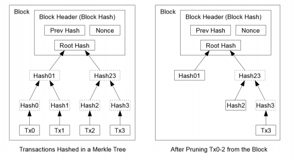

> 这段是针对区块链系统会不断产⽣的区块问题的⼀个解决⽅案。如截⽌⽬前为⽌(2017/1/28)，区块链总数已经超过了90G，虽然存储是越来越不值钱了，但是要普通公众使⽤是不可能的，因为信息在⼀直膨胀。这⾥就体现出区块链系统的精妙之处，它不存储交易，⽽是使⽤Merkel HashTree的⽅式存储Root Hash，达到”0知识证明“。个⼈并不⼀定需要这个区块，⽽是具有这个区块的”hash“(索引)就⾜够了，有IPFS，公共节点，信任度⾼节点帮助存储这些区块。”0知识证明“保证了区块是绝对正确的⽽不是伪造的。

⼀个剔除交易的区块头⼤概会是80byte⼤⼩。如果我们假设区块每10分钟就⽣成⼀个，那么80bytes *6 * 25 * 365 = 4.2MB 每年。2008 年PC系统通常的内存容量为2GB，按照摩尔定理预⾔的每年增⻓1.2GB的⼤⼩，即使将全部的区块头存储在内存之中都不是问题。

> 原⽂中已经论述的相当清楚了。


## 8.简化⽀付认证( Simplified Payment Verification )

认证⽀付不需要运⾏所有的⽹络节点是可能的。⼀个⽤户只需要保存最⻓⼯作量证明链的区块头部的拷⻉就⾏，这条链他只需要查询⽹络节点直到他确信他拥有最⻓链为⽌，并能够通过merkle的分⽀连接到它(这个⽤户的交易transaction)被加上时间戳的那个区块中的那次交易。他⽆法⾃⼰检查这笔交易(因为只有hash)，但是通过连接到链中的位置，他可以看到⼀个⽹络节点曾经接受过它(那笔交易)，并且在它后⾯增加的区块也进⼀步证明⽹络曾经接收过它。

> ⽽回收硬盘空间所带来的问题就是简化⽀付认证的问题，因为有些节点已经不会持有全部区块信息，这⾥相当于是⼀个博弈了，使⽤空间换认证的便捷。但总之是不会再信息的安全性上出问题的。因为只要持有了hash作为标识，⽆论什么节点总是能从其他节点上请求到原始信息。 

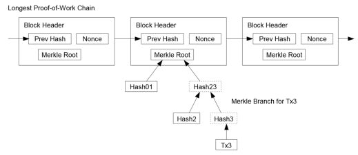

> 该图表明只要有hash链就⾏。

这样的情景下，如要诚实节点控制了⽹络，那么这个验证就是可靠的，但是当⼀个算⼒占优的攻击者控制⽹络的时候就变得更容易受攻击了。因为⽹络中的节点能够⾃⼰进⾏验证的时候，这个简化的⽅法能够被攻击者伪造的(fabricated)的交易欺骗，当这个攻击者能够持续保证超过全⽹的算⼒的时候。⼀种保护的策略是接受⽹络节点们的警告，当这些⽹络节点监测到⼀个⾮法的区块，提醒⽤户软件去下载这个有问题的全部区块，并警告交易去检查确认⼀致性。频繁收到⽀付信息的商业机构可能会仍然运⾏他们的全节点以保持更加独⽴的安全性和更快的验证。

> 这种机制感觉有点像是打补丁的⽅式。。但是好像确实是要削减硬盘存储的⼀个解决⽅案，是存储与安全便捷的⼀个博弈结果。很可能有机会在这⾥做⽂章，或许是区块链运⽤推⼴的⼀个障碍。因为要是保留区块的节点太少了就有可能造成问题。虽然不能窃取篡改⽹络，但是却可导致崩溃。(当然不是说bitcoin⽹络，是说⼀些⼩型区块链⽹络)

## 9.组合和分割价值(Combining and Spliting Value)

虽然可以独⽴的处理货币，但是在⼀次转账中为每⼀分钱都成为⼀个分离的交易是不明智的(就是说coin不是由元单位组合起来的)。为了允许价值能够分割和组合，交易包含了多个输⼊和输出。正常情况下会有⼀个从前⾯⼀⼤笔交易⽽来的⼀个单笔输⼊或者包括很多更⼩总数的多笔输⼊，然后最后会有两笔输出，⼀个是付款，另⼀个是找零，不管有多少，全部都返回购买者。

> 这⾥段终于说到了⼀个交易(Tx)的构成，前⾯的论述已经说了很多，只要抓住⼀个关键点就新：⼀个交易是由前⾯的交易进⾏验证，加上转移的数⽬和⽬的地构成。inputs就是之前的交易的outputs。对所有的inputs进⾏验证，就可得到该交易的付款者的余额是否⼤于要转移的数⽬。inputs关联的所有Tx就是之前的”历史信息“，节点可检索⾃⼰的区块获得结果。每个区块的第⼀个交易(激励交易)就相当与只有Input⽽没有output。
> 
> 这⾥要注意的额外⼀点就是：每次的交易必须被花完，只不过是所有input的综合，其中⼀部分给了收款⽅，⽽找零则是全部返回到购买者上(回想下前⽂阐述的铸币⼚的⼯作流程)。这种机制在数⽬的分割上有天然优势。现有的货币总是有⼀个最⼩单位作为”元“单位(⽐如⼈⺠币：1分)，但是bitcoin却没有这样的限制，它只关⼼差额，⽽不关⼼最⼩元单位。所以这就是价值的组合和分割。 


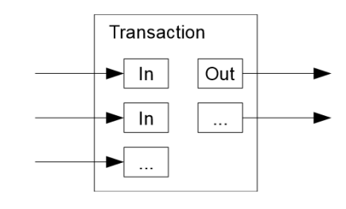


应该被注意到那个全部分配(fan-out)，这⾥⼀个交易依托⼏个交易，然后这⾥交易⼜依托于更多的。这不是个问题。这⾥是没有必要去提取交易历史的完整独⽴副本。

> 这⾥略难翻译，我不是很清楚这⾥的 fan-out 指代的是什么。

## 10.隐私(Privacy)

传统的银⾏模型实现隐私的等级是通过限制访问信息给相关的参与者和第三⽅。当需要将全部交易公开⼴播的时候，就不能使⽤这种⽅法了。但是隐私仍然能够被维护通过打破在另⼀个地⽅的信息流：通过使公钥匿名的形式。公众可以看到有⼀个⼈发送了⼀笔数⽬给另⼀个⼈，但是没有信息能把交易和⼈联系在⼀起。这和股票交易中释放的信息等级类似，在股票交易中公开发布的时间和个⼈的交易是记录在案的"tape"，但是是不会告知是谁参与进来。

> 这⾥指出使⽤公私钥的机制是⼀种伪匿名化。 

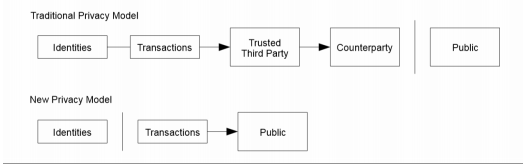

作为附加的防⽕墙(防范机制)，在每次交易中都使⽤⼀个新的密钥对能够保证把这些密钥和⼀个⼈联系起来。⼀些多笔输⼊的交易的联系仍然是不可避免的，因为在这点(多笔输⼊)揭示了上这些输⼊是属于同⼀个⼈的。⻛险就在于，如果只要其中⼀个key的拥有者被发现了，那么相关联的属于这个⼈的其他交易也会被揭示。


> 这⾥原⽂中推荐这样做是相当有道理的。因为椭圆加密算法是能被量⼦暴⼒破解的，在整个系统中要是产⽣的转账公钥是被公开的。虽然从密码学上不应该从公钥推导到私钥，但是还是有例外嘛。所以这⾥中本聪强烈建议，⼀次转账就使⽤⼀对新的密钥对(因为交易只要被作为inputs后那么作为inputs的交易也就没⽤了(注意9提到的找零机制，每笔都花完))，那么就可以保证每次都是新的公私钥进⾏交易。
> 
> 后半段是说对于公私钥和现实中的⼈的对应关系(匿名性失效)的问题，换钥匙同样可以防⽌这点发⽣，但是要注意因为所有的记录的全⽹可查的，所以要是其中⼀个公私密钥和⼈对应起来了，那么所有关联的公私密就能和这个⼈对应起来。


## 11 计算(计算)

我们考虑这样⼀个场景：⼀个攻击者尝试去⽣成⼀个⽐现在最诚实链还⻓的替换链。即便这样是可完成的，这也不会抛出这个系统就被任意控制了，⽐如像凭空创造价值或者拿去本来不属于攻击者的钱。节点是不会接受⽆效的交易作为⽀付的，并且最诚实链从不会接受⼀个包含⽆效信息的区块。⼀个攻击者只可以尝试去改变他⾃⼰的⼀个交易去拿回他最近花掉的钱。

最诚实链和攻击者链的竞争可以看作是⼀个Binomial RandomWalk(⼆叉树随机漫步)。成功事件是最诚实链扩⼤了⼀个区块，使其+1领先(lead)，同时失败事件是攻击者链扩⼤⼀个区块，使得-1差距(gap)。

攻击者赶上给定的亏损的可能性可以看作是⼀个 Gambler's Ruinproblem(赌博破产问题)。假定⼀个有⽆限的信⽤赌徒从⼀个亏损开始并且进⾏潜在⽆限次的尝试想要追上保本。我们可以计算他达到保本的可能性(概率)，就是⼀个攻击者要追上最诚实链，如下所示：

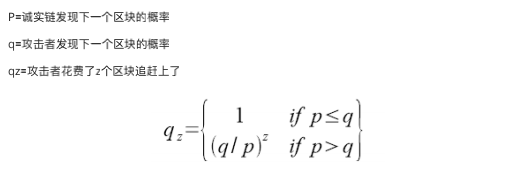


我们假设p>q，那么攻击者追上的概率就会随着区块的增加⽽指数型下降。因为胜算是和他相违背的，如果他不能相当幸运的在早期就赶上，他成功的⼏率就会变得更⼩随着他落后更多。我们现在考虑⼀个新的交易能够被充分的确认让发送⽅不能再更改交易的情况要等多久。我们假设付款⽅就是⼀个攻击者，他想要要收款⽅认为他已经付过款了并且之后把这个钱在付款后拿回来，收款⽅当这件事情发⽣的时候会被通知警告，但是付款⽅希望这件事情很久才发⽣。

接收⽅⽣成了⼀个新密钥对并把这个公钥给了付款⽅在付款⽅前⾯前很短的时间。这样就阻⽌了付款⽅能够事先准备好⼀个在时间之前的区块链，通过持续的⼯作直到他⾜够幸运的⾛到了很前⾯，然后在那时执⾏了这个交易。⼀个这个交易被发送，这个不诚实的发送者开始为包含替换他交易的版本的并⾏链秘密⼯作。

接收者⼀直等到这个交易被加⼊到区块中并且之后z个区块被附加到着之后。他不知道攻击者已经做的确切的过程总数(已经做了多少个块)，但是假设诚实链耗费可预期的平均时间产出⼀个区块，那么攻击者的潜在进展就是⼀个泊松分布，分布的期望值是： 


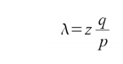


为了得到攻击者能追上的概率，我们将泊松密度乘以他可以从该点追上的概率的每个进展数 

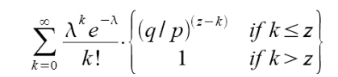


##为了避免求⽆穷极速我们重新整理 

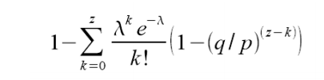


转换成c代码：
```java
#include<math.h>

doubleAttackerSuccessProbability(double q, int z){
     double p= 1.0 - q;
     doublelambda = z * (q / p);
     doublesum = 1.0;
     int i, k;
     for (k =0; k <= z; k++) {
         doublepoisson = exp(-lambda);
         for (i = 1; i <= k; i++)
         poisson *= lambda / i;
         sum -= poisson * (1 - pow(q / p, z - k)); 
    } return sum; 
}
```

运⾏得到结果，我们可以看到概率随z的指数下降。>q=0.1z=0 P=1.0000000z=1 P=0.2045873z=2 P=0.0509779z=3 P=0.0131722z=4 P=0.0034552z=5 P=0.0009137z=6 P=0.0002428z=7 P=0.0000647z=8 P=0.0000173z=9 P=0.0000046z=10 P=0.0000012q=0.3z=0 P=1.0000000z=5 P=0.1773523z=10 P=0.0416605z=15 P=0.0101008z=20 P=0.0024804z=25 P=0.0006132z=30 P=0.0001522z=35 P=0.0000379z=40 P=0.0000095z=45 P=0.0000024z=50 P=0.0000006求解令P<0.1%的z值：P <0.001q=0.10 z=5q=0.15 z=8q=0.20 z=11q=0.25 z=15q=0.30 z=24q=0.35 z=41q=0.40 z=89q=0.45 z=340

> 这⾥就是指明，等6个区块是绝对稳妥的⽅法。

## 12.结论


我们提出了⼀种不依赖信任的电⼦交易系统。我们从由数字签名构成的通常的货币框架开始，这提供了⼀个拥有关系的强控制，但是没有办法解决双重⽀付的问题。为了解决这个问题，我们提出⼀种使⽤⼯作量证明机制的p2p⽹络来记录⼀个公共的交易历史，这种机制变为了当⼤多数节点控制主要的CPU算⼒，那么攻击者想要改变是在计算上不可能的。⽹络在其⾮结构化简单性⽅⾯是鲁棒的。节点只需要很少的协同就可以共同⼯作。他们不需要被认证，因为信息不需要被路由到某个特定的地⽅⽽是只需要被尽可能的被发送出去。节点可随意离开或重加⼊⽹络，接受⼯作量证明链作为当这个节点离开后发⽣事件的证明即可。他们根据CPU算⼒投票，表示接受合法的区块通过扩展这个区块，拒绝接受⾮法的块通过拒绝在这个块后⼯作。任何需要的规则和激励都可以通过这种共识机制来执⾏。