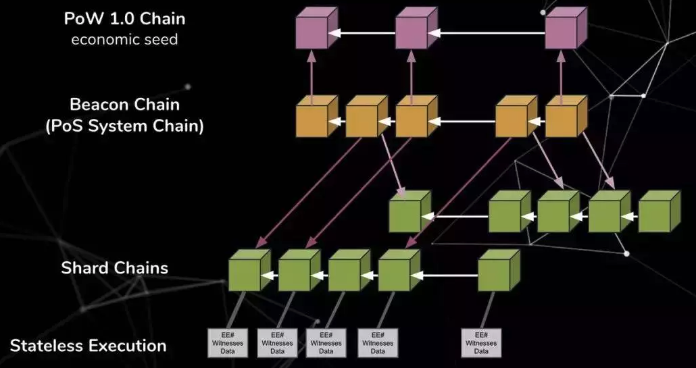

# 以太坊2.0详细介绍

## 1.0的不足
现在以太坊 1.0 处理速度很慢；整个网络每秒仅能处理 15 笔交易，而且，通过这些交易进行任何复杂的操作都会带来极其高昂的成本。相比之下，Visa （总部位于美国的支付服务提供商）每秒能处理上千笔交易。

以太坊的效率为何如此低下？使用成本为何如此高昂呢？

一言以蔽之，去中心化在创造巨大价值的同时也会带来极高的成本（至少现在是如此）。实现去中心化的成本之所以如此之高，是因为与如今大多数区块链一样，以太坊上的每个节点（即，连接至以太坊网络的计算机，例如，运行以太坊软件的笔记本电脑）都必须各自执行记载到区块中的每一个计算，以确保所有参与者都遵守规则。这个过程要耗费能源和计算机资源。

有没有可能创建一条区块链，让每个节点都只需处理部分，而无需处理全部交易呢？这样一来，每个节点都只需处理网络中很少一部分交易，从而降低通信成本。

> 那就是以太坊 2.0 。

## 2.0简介

以太坊 2.0 就是新一代以太坊，我们甚至不该称之为以太坊。以太坊 2.0 是一个完全不同的项目，在区块链的架构上采用了全新的思路。以太坊 2.0 的目标是提高以太坊的可扩展性、安全性和可编程性。不同于以太坊 1.0 只能达到 15 TPS 的吞吐量，以太坊 2.0 每秒可处理上千至上万笔交易（甚至更多），同时不用降低其去中心化程度。实际上，以太坊 2.0 想引入一种经济安全性更强的共识机制，叫作权益证明（PoS），而不是沿用比特币和以太坊 1.0 所用的工作量证明（PoW）。

在传统的 PoW 区块链（如比特币）中，一些个人和机构会充当矿工的角色，利用价格高昂的硬件来解决数学难题，从而铸造新的比特币，并处理交易。矿工通过维护网络安全性来获得增发的比特币和交易费。相比之下，在（以太坊 2.0 等）PoS 区块链中，验证者通过锁定以太币来为网络提供安全性，从而铸造新的以太币，并处理交易。那么实际上，验证者提供的安全性取决于网络本身的价值。如果有验证者作恶（例如，投票通过恶意交易），其锁定的以太币就会被 罚没 。罚没机制会激励验证者遵守协议规则。

PoS 之所以具有较高的安全性，一个很大的原因是 PoW 系统容易遭受 “蹲点（spawn camping）” 攻击。如果作恶者所掌握的挖矿硬件足以攻击比特币等 PoW 区块链，比特币便无力阻止后续攻击，因为网络会不断发生 重组/分叉，然后又会被同一帮挖矿硬件攻击，如此无休止地循环下去。相比之下，以太坊 2.0 抵御蹲点攻击的能力要强得多——以太坊 2.0 可以分叉并罚没攻击者的押金。这就好比摧毁了攻击者的比特币矿场。

此外，以太坊 2.0 能让开发者创建自己的交易处理方法，即，执行环境，以便其在以太坊网络内使用其它区块链的规则。用极度简化的说法来说明 “执行环境” 就是：以太坊 2.0 可以让人们使用比特币、ZCash、以太坊 1.0 的交易规则，以及其它想得到的规则集合，其规模比目前以太坊 1.0 所能达到的规模高出了几个数量级，均由同一组缴纳了押金的验证者保护其安全性。以太坊 2.0 通过分片实现了这一点：在以太坊 2.0 中，每一条分片链都有各自专属的出块者和验证者，而且这些分片链彼此之间联系紧密，可以互相通信，因此形成了一个大型分片链网络。因此，以太坊 2.0 的验证者无需处理整个网络内的所有交易，只需处理并验证某条分片链上的交易。通过这一创新技术，使用消费级硬件的人也能够参与以太坊 2.0 网络，为其做出贡献。

### 设计的目的

1. 使其更加简洁，哪怕影响一些效率
2. 当主要网络分区以及大部分节点离线时仍能保持存活状态
3. 选择可以抵抗量子计算的组件或者使用日后可以替换为抗量子计算的组件
4. 使用加密技术并使验证者在单位时间里能够参与更多的出块
5. 使任何消费级个人电脑也可以参与到分片的处理中

## 2.0的架构

整个以太网2.0分为四层：

* POW主链层：也就是以太坊1.0的单链，作为最底层的基础，在以太坊1.0向2.0过渡阶段，会将以太坊1.0中的价值（以太币）逐渐转移到信标链中，当以太坊2.0过渡完成，可能会作为一条分片链，也可能继续保留，还未有定论。
* 信标链层：此层最终将是分片链的管理层，负责管理分片链，并参与分片链之间的互通，在过渡阶段也涉及价值转移等。
* 分片链层：64条不同的链，与同一条信标链进行沟通，存储数据，运行合约等，每一条链都相当于一条以太坊1.0。
* 虚拟机层：eWASM虚拟机，运行智能合约的执行环境，建立于分片上。

### 第0阶段（Phase 0）
在以太坊 1.0 （Ethereum 1.0）中，使用工作证明（Proof of Work, PoW）作为共识机制（Consensus），并借此产生新的区块。为了要减少工作证明产生新区块时，所需要的大量算力，以及所花时间过长的问题，以太坊 2.0 将改为权益证明（ Proof of Stake, PoS）作为产生新区块的共识机制。

第零阶段会建立信标链（Beacon Chain），信标链就是以太坊 2.0 系统层级的链，当从以太坊 1.0 移转到以太坊 2.0 时，信标链扮演着非常重要的角色，它是整个系统的基础。

一旦第零阶段完成，将会有两个使用中的以太坊链。以太坊 1.0 链（目前所使用的 PoW 主链）以及以太坊 2.0 链（新的信标链）。在这个阶段，使用者在 1.0 链把以太币锁到合约里以注册公钥，2.0 链会承认合约内注册的公钥。但是，他们无法将该以太币迁移回去以太坊 1.0 链上面，为了要执行信标链，你会需要一个信标链的客户端。目前，许多团队正在开发这些客户端。

### 第1阶段（Phase 1）
第1阶段会加入分片链（Shard Chains），在这个阶段主要专注于分片链的数据结构，以及其有效性（Validity）和共识性（Consensus），分片链在这阶段只当作数据链，并不会指定分片链状态执行（State Execution）或帐户余额（Account Balances）。这比较像是对分片结构进行测试，而不是尝试利用分片来对信标链进行扩展。在这阶段，信标链会把分片链的区块（Block），当作没有结构或意义的位元集合（Collections Of Bits）。以太坊 1.0 和以太坊 2.0 仍将同时存在，并且在以太坊 2.0 链上进行测试和迁移。

这个阶段分片链会与信标链交联（Crosslinks），每个分片的当前状态— “结合数据根（Combined Data Root）”，会定期记录在 “信标链” 区块中，作为交联。信标链区块完成后，相应的**分片区块（Shard Block）**将被视为已完成，其他分片知道它们可以依靠这些区块进行跨分片交易。

交联是委员会（Committee）的一组签名（Signatures），证明了分片链中的某个区块，可以包含在信标链中。交联是信标链 “理解” 分片链更新状态的主要方式。交联还用作异步跨分片通信的基础结构。

信标链在每个时段（Slot）中的每个分片，随机选择分片验证者（Shard Validators），分片验证者只是用来在每个区块的内容上达成一致，他们通过交联证明分片的内容和状态，分片中包含什么内容都没有关系，只要所有委员会都达成共识，并定期更新分片上的信标链即可。

### 第2阶段（Phase 2）
第2阶段会将所有功能开始结合在一起，在第二阶段，会完成分片化，分片链从简单的数据容器过渡到结构化链状态，并将重新引入智能合约。每个分片将管理基于 **eWASM（Ethereum flavored WebAssembly）**的虚拟机。它会支援帐户（Accounts）、合约（Contracts）、状态（State），以及 Solidity 中我们熟悉的其他抽象化，预计在第二阶段之前或第二阶段开发时，大家熟悉的工具（例如 Truffle、Solc、Ganache）需要转换成支持 eWASM 的版本，以太坊 1.0 及以太坊 2.0 可借由双向桥接来互通，会有可扩展的 Layer 1 执行，借由无状态执行，来提高执行速度。

## 二、新的分片提案

以太坊 2.0 原提案所运作的机制，是以每个时期（Epoch）为单位，来进行交联的动作，每个链上有 1024 个片（Shards），当需要跨分链交易（Tx）时，由于是每个时期进行交联，会有较大的延迟时间；新提案更新为每个时段都进行交联的动作，并减少**片（Shards）**的数量为 32 个，来降低跨分片（ Cross-Shard）交易时的延迟时间，每个时段都进行跨分片交易。

### 新提案的优点

对于以太坊 2.0 新提案的优点，首先新提案的片（Shards）数量由 1024 个降至 32 个，降低了运算的复杂度，因为跨分片时间，从一个 epoch 降到一个 slot，时间缩短的好处，是给 DApp 开发者及使用者更好的体验。在原本以太坊 2.0 的设计中，需要复杂的手续费市场模型与乐观（Optimistic） 解决方案，来实现跨分片交易手续费（Cross-Shard Transaction Fee）。但新提案改变了执行环境的设计，使得原本的复杂模型可以被大幅简化。

### 新提案的交易

新提案只需要比之前的提案更少的片（Shards），就可以启动交易，可能会有更长的分片时段（12s），更大的分片区块（Shard Block），目前更新到第零阶段，第零阶段测试网（Testnets）的测试，可能会有所延迟，新提案减少了第零阶段发布所需的时间。

## 执行环境

在之前设计的以太坊 2.0 和以太坊 1.0 中，状态在共识机制里，扮演着非常重要的角色，共识机制会随时去读写所有的状态，不管是执行的概念、交易的概念、帐户的概念、树状结构的概念、以及所有在数据结构中的概念，都深深地融入共识中。

上图是以太坊 1.0 的简易架构图，在图中我们可以看到共识机制及一条链，共识机制里包含了状态及一个执行引擎，状态里包含了状态树，在这里的执行引擎使用硬编码规则，里面包含了执行交易、帐户模型和帐户结构，我们可以看到图的右边有一条链，链上面有交易数据，在以太坊 1.0 中，我们会在交易数据上执行共识机制，去修改和更新状态。

执行环境是一个单独的虚拟机器，在以太坊 1.0 中，会有一个特定的帐户模型（Account Model），以及事先定义好的操作码（Opcodes），矿工机制（Gas Mechanisms）和状态根（State Root ），以太坊虚拟机（Ethereum Virtual Machine, EVM）就是一种特定的执行环境。

如果遵循 EIP（Ethereum Improvement Proposals）的建议，开发者总是在要求新的操作码，或着是更改**矿工成本（Gas Cost）**来支援他们的应用，像是 Plasma 和 Zkrollup 这样的例子有很多，这样就会需要修改 EVM 1.0 的执行环境，才能支援到他们的应用程式（DApp）。

但是在以太坊 2.0 的第二阶段中，我们可以支持多个执行环境。也可以有多个状态根，不同的帐户模型等。举个例子，你可以定义一个脸书币执行环境（Libra EE），以便在以太坊 2.0 上运行Libra。或者，您可以定义一个比特币执行环境（BitCoin EE），这样就可以在以太坊 2.0 上运行比特币。

在以太坊 2.0 简易架构图中我们可以看到状态根，它可能是 32 Bytes 的 Blob，上面有 WASM 的执行码（Execution Code），可以在使用者层级中去做细部设定。图片右边有一个链，链上有一般的交易数据以及见证（Witnesses），见证实际上显示在数据库的区块中，你需要针对该状态而不是数据库执行该笔交易，而且还需要证明数据对于当前状态根是有效的。举个例子，如果我们要在帐户 A 和帐户 B 之间传递数值，假设从帐户 A 移动 5 以太币到帐户 B，我们不能直接说帐户和余额（Balance）是确实可用的，在过程中，我们需要加入见证数据（Witness Data），来证明两个帐户当前的状态，当执行码正在执行交易数据时，状态根可以修改和更新状态树。

执行环境并不是共识机制预先定义好的，他可以在使用者层级上去做新增，我们也可以把以太坊 1.0 复制一份到以太坊 2.0 的执行环境中，将现有的状态根放入 EVM 直译器，用默克尔见证验证器（Merkle Witness Verifier）来当作他的执行码。

在原先的提案中，状态和共识息息相关，且执行帐户和共识中包含了状态树结构；而在新的提案中，执行环境为无状态模型（Stateless Model），高度抽象化的，并且它的可扩展性，相较原先的提案高出非常多。

## 双向桥接

讲者先前提过的提案中，以太坊 2.0 最初有一个单向桥接，所以你可以从以太坊 1.0 转换到以太坊 2.0，但是最初的架构不允许回传，这主要是出于几个原因，这需要我们将以太坊 1.0 的发展与以太坊 1.0 和以太坊 2.0 的硬分叉紧密结合，并把两个系统置于互相影响的风险之中，因此团队认为以太坊 2.0 在发布且稳定之前，将两边紧密耦合是不明智的。

### 单向桥接的问题
月初在日本大阪举行的 Devcon 5 上，桥接的问题受到了广泛的讨论，原提案的**单向桥接（One-Way Bridge）**模式，会有验证者流动性的问题，而且更重要的是，它可能会引发以太坊 1.0 和以太坊 2.0 之间的可替代性问题，如果我们允许以太坊 2.0 上的流动性，那么某种形式的转移机制，就会在将以太坊 1.0 分叉到以太坊 2.0 之前，或着是在双向桥接之前产生，交易所中很可能会同时有两个币，团队和整个验证者社区都很担心这个问题，目前正在找寻减轻这个问题的方法。

另外也希望鼓励大家，在这些早期阶段进行验证，但是在早期阶段进行验证，肯定会有很高的风险，因为存在未知的锁定期，因此也希望找到方法减轻这种风险。

### 双向桥接的问题

双向桥接目前可能的路线有两条，一种是在以太坊 1.0 上面，建立以太坊 2.0 的轻节点；另一种是在以太坊 1.0 上运作以太坊 2.0 的全节点。

##### 路线 Ａ：在以太坊 1.0 上，建立以太坊 2.0 轻节点

这个路线需要在实际的 EVM 中支援 BLS-12–381，会花费很多开发时间，而且它只提供**轻量客户端（Light-Client）**层级的安全性。当验证者在 2.0 链上产生提款交易的收据时，我们会拿到以太坊 2.0 的轻量客户端证明，一但收收据的区块在以太坊 2.0 上敲定了，你就可以在以太坊 1.0 的合约上提款。不过，这可能不是团队最终选择的路线。

##### 路线 Ｂ：在以太坊 1.0 上，运行以太坊 2.0 的全节点

第二种路线，会在以太坊 1.0 的节点上，运行以太坊 2.0 的全节点，这个路线允许我们使用敲定性机制，因此，我们不仅可以使用这种机制，来促进以太坊 1.0 和以太坊 2.0 之间的转移，我们也可以利用验证者的安全性，来保护以太坊 1.0 链，我认为大家对此感到非常兴奋，这通常被称为 “敲定性小工具提案（Finality Gadget Proposal）”。

但是还是需要一种机制，去输出以太坊 2.0 状态根在以太坊 1.0 上，所以有一些以太坊 2.0 社群的讨论，在研究如何实作它，可能会包含矿工机制。

输出以太坊 2.0 状态根的另一个优势，是以太坊 1.0 有稳固的机制可以实现它，以及同时拥有以太坊 2.0 的高扩展性及数据可用性，可以做一些有趣的应用，像是 ZK Rollup 和 Optimistic Rollup。

### 双向桥接的优点
如果你在交易所中，列出以太坊 1.0 以太币和以太坊 2.0 以太币，它们的价格应该一样。如果不一样，你可以用较低的价格买一个以太币，把他发送到桥上，然后以较高的价格获得另一种以太币，并把它出售。这种套利会使它们的价格保持不变，这样会让用户，验证者和开发人员感到困惑，双向桥接可以防止两边的货币借由套利的形式，来互相转换。

### 双向桥接的交易
但是还是有一些权衡在这里，尽管对以太坊 2.0 的设计非常有信心，团队还是希望在影响到以太坊 1.0 的安全性和风险状况之前，先在生产环境中得到验证。

双向桥接是一种紧密耦合的共识机制，对于两边链的攻击及产生的问题，都会影响到另一边的链，协定的开发势必会非常烦琐，我们需要考虑到每个协定的安全性，如果我们越早开发协议，那么我们实际上的进度就越少，当每个障碍随着时间发展，它们就会相互阻碍，这让以太坊 1.0 在这一点上的开发速度比以太坊 2.0 慢得多，因为实际用户群存在很多担忧，并且需要大量的协调，才能在我们的生产网络上获得硬分叉。

所以，如果我们越早将这些东西连在一起，就可能会减慢以太坊 2.0 的开发和分叉周期，并且这增加了一些额外的开销，换句话说，验证我们可以链接客户端的开销是相对的。