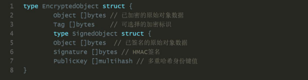

# IPFS - 可快速索引的版本化的点对点文件系统

## 摘要 

星际文件系统是一种点对点的分布式文件系统， 旨在连接所有有相同的文件系 统的计算机设备。在某些方面， IPFS 类似于 web, 但 web 是中心化的，而 IPFS 是一个单一的 Bittorrent 群集， 用 git 仓库分布式存储。换句话说， IPFS ᨀ 供了高吞吐量的内容寻址块存储模型， 具有内容寻址的超链接。这形成了一个 广义的 Merkle DAG 数据结构，可以用这个数据结构构建版本文件系统，区块链， 甚至是永久性网站。。IPFS 结合了分布式哈希表， 带有激励机制的块交换和自 我认证命名空间。IPFS 没有单故障点， 节点不需要相互信任。 

## 1. 介绍 

在全球分布式文件系统这领域， 已经有许多人的尝试。一些系统已经取得了重 大的成功， 而很多却完全失败了。在学术尝试中， AFS【6】就是成功的例子， 如今已经得到广泛的应用， 然而，其他的【7， ？】却没有得到相同的结果。 在学术界之外，应用最广泛的是面向音视频媒体的点对点文件共享系统。 最值 得注意的是， Napster, KaZaA 和 BitTorrent[2]部署的文件分发系统支持 1 亿 用户的同时在线。即使在今天， BitTorrent 也维持着每天千万节点的活跃数。 基于这些学术文件系统理论而实现的应用程序有很多的用户量， 然而，这些系 统理论是在应用层，而没有放在基础层。以致没有出现通用的文件系统基础框架， 给全球ᨀ供低延迟的分发。 

也许是因为 HTTP 这样“足够好“的系统已经存在。到目前为止，HTTP 已经作为 “分布式文件系统“的协议，并且已经大量部署，再与浏览器相结合，具有巨大 的技术和社会影响力。在现在， 它已经成为互联网传输文件的事实标准。然而， 他没有采用最近 15 年的发明的数十种先进的文件分发技术。 从一方面讲， 由 于向后兼容的限制 和 当前新模式的投入， 不断发展 http web 的基础设施几 乎是不可能的。但从一个角度看， 从 http 出现以来， 已经有许多新协议出现 并被广泛使用。升级 http 协议虽然能引入新功能和加强当前 http 协议，但会降 低用户的体验。 

有些行业已经摆脱使用 HTTP 这么久， 因为移动小文件相对便宜，即使对拥有 大流量的小组织也是如此。但是，随着新的挑战，我们正在进入数据分发的新纪 元。

* （a）托管和分发 PB 级数据集， 
* （b）跨组织的大数据计算， 
* （c）大批量的高清晰度按需或实时媒体流，
* （d）大规模数据集的版本化和链接， 
* （e）防止意外丢失重要文件等。其中许多可以归结为“大量数据，无处不在”。

由于关键功能和带宽问题，我们已经为不同的数据放弃了 HTTP 分销协议。下一 步是使它们成为 web 自己的一部分。 正交于有效的数据分发，版本控制系统，已经设法开发重要的数据协作工作流程。 Git 是分布式源代码版本控制系统，开发了许多有用的方法来建模和实现分布式 数据操作。Git 工具链ᨀ供了灵活的版本控制功能，这正是大量的文件分发系统 所严重缺乏的。由 Git 启发的新解决方案正在出现，如 Camlistore [？]，个人 文件存储系统，Dat [？]数据协作工具链和数据集包管理器。Git 已经影响了分 布式文件系统设计[9]，因为其内容涉及到 Merkle DAG 数据模型，能够实现强大 的文件分发策略。还有待探讨的是，这种数据结构如何影响面向高吞吐量的文件 系统的设计，以及如何升级 Web 本身。 本文介绍了 IPFS，一种新颖的对等版本控制的文件系统，旨在调和这些问题。 IPFS 综合了许多以前成功的系统的优点。 IPFS 产生了突出的效果， 甚至比参 考的这些系统的总和还要好。IPFS 的核心原则是将所有数据建模为同一 Merkle DAG 的一部分。 

## 2. 背景 

本节回顾了 IPFS 所采用成功的点对点系统技术的重要属性。 

###  2.1 分布式哈希表(DHT) 分布式散列表（DHT）被广泛用于协调和维护关于对等系统的元数据。比如， MainlineDHT 是一个去中心化哈希表，他可追踪查找所有的对等节点。 

**2.1.1 KADEMLIA DHT**

Kademlia[10] 是受欢迎的 DHT, 它提供： 
1. 通过大量网络进行高效查询：查询平均联系人 O(log2N)节点。 （例如，20 跳 10 万个节点的网络） 
2. 低协调开销：优化数量的控制消息发送到其他节点。
3. 抵抗各种攻击，喜欢长寿节点。 
4. 在对等应用中广泛使用，包括 Gnutella 和 BitTorrent，形成了超过 2000 万 个节点的网络[16]。 

**2.1.2 CORAL DSHT**

虽然一些对等文件系统直接在 DHT 中存储数据块，这种“数据存储在不需要的节 点会乱费存储和带宽”[5]。Coral DSHT 扩展了 Kademlia 三个特别重要的方式： 

1. Kademlia 在 ids 为“最近”（使用 XOR-distance）的关键节点中存储值。这 不考 虑应用程序数据的局部性，忽略“远”可能已经拥有数据的节点，并强制 “最近”节点存储它，无论它们是否需要。这浪费了大量的存储和带宽。相反， Coral 存储了地址， 该地址的对等节点可以ᨀ供相应的数据块。 
2. Coral 将 DHT API 从 get_value(key)换成了 get_any_values(key)（DSHT 中的 “sloppy”）中。这仍然是因为 Coral 用户只需要一个（工作）的对等体，而不 是完整的列表。作为回报，Coral 可以仅将子集分配到“最近”的节点，避免热 点（当密钥变得流行时，重载所有最近的节点）。 
3. 另外，Coral 根据区域和大小组织了一个称为群集的独立 DSHT 层次结构。这 使得节点首先查询其区域中的对等体，“查找附近的数据而不查询远程节点”[5] 并大大减少查找的延迟。 

**2.1.3 S/KADEMLIA DHT**

S/Kademlia[1] 扩展了 Kademlia, 用于防止恶意的攻击。有如下两方面的方法： 

* 1.S/Kad ᨀ供了方案来保证 NodeId 的生成已经防止 Sybill 攻击。它需要节点产 生 PKI 公私钥对。从中导出他们的身份，并彼此间签名。一个方案使用 POW 工作 量证明，使得生成 Sybills 成本高昂。 
* 2.S/Kad 节点在不相交的路径上查找直， 即使网络中存在大量的不诚实节点， 也能确保诚实节点可以互相链接。即使网络中存在一半的不诚实节点，S/Kad 也 能达到 85%的成功率。 

### 2.2 块交换 

BitTorrent BitTorrent[3] 是一个广泛成功应用的点对点共享文件系统，它可以在存在不信 任的对等节点（群集）的协作网络中分发各自的文件数据片。从 BitTorrent 和 它的生态系统的关键特征， IPFS 得到启示如下： 

1. BitTorrent 的数据交换协议使用了一种 bit-for-tat 的激励策略， 可以奖励 对其他方面做贡献的节点，惩罚只榨取对方资源的节点。 
2. BitTorrent 对等体跟踪文件的可用性，优先发送稀有片段。这减轻了 seeds 节点的负担， 让 non-seeds 节点有能力互相交易。 
3. 对于一些剥削带宽共享策略， BitTorrent 的标准 tit-for-tat 策略是非常脆 弱的。 然而，PropShare[8]是一种不同的对等带宽分配策略， 可以更好的抵制 剥削战略， ᨀ高群集的表现。 

### 2.3. 版本控制系统

Git 版本控制系统ᨀ供了对随时间变化的文件进行建模的设施，并有效地分发不同的 版本。流行版本控制系统 Git ᨀ供了强大的 Merkle DAG 对象模型，以分布式友 好的方式捕获对文件系统树的更改。 

1. 不可更改的对象表示文件（blob），目录（树）和更改（ᨀ交）。 
2. 通过加密 hash 对象的内容，让对象可寻址。 
3. 链接到其他对象是嵌入的，形成一个 Merkle DAG。这ᨀ供了很多有用的完整 和 work-flow 属性。 
4. 很多版本元数据（分支，标示等等）都只是指针引用，因此创建和更新的代价 都小。
5. 版本改变只是更新引用或者添加对象。 
6. 分布式版本改变对其他用户而言只是转移对象和更新远程引用。 

### 2.4 自我认证认文件系统-SFS 

SFS [ 12，11 ]ᨀ出了两个引人注目的实现（a）分布式信任链，和（b）平等共 享的全局命名空间。SFS 引入了一种自我建构技术—注册文件：寻址远程文件系 统使用以下格式：

## 3. IPFS 设计
IPFS 是一个分布式文件系统，它综合了以前的对等系统的成功想法，包括 DHT，BitTorrent，Git 和 SFS。 IPFS 的贡献是简化，发展和将成熟的技术连接成一个单一的内聚系统，大于其部分的总和。 IPFS ᨀ供了编写和部署应用程序的新平台，以及一个新的分发系统版本化大数据。 IPFS 甚至可以演进网络本身。

IPFS是点对点的;没有节点是特权的。IPFS节点将IPFS对象存储在本地存储中。节点彼此连接并传输对象。这些对象表示文件和其他数据结构。 IPFS 协议分为一组负责不同功能的子协议：

1. 身份 - 管理节点身份生成和验证。
2. 网络 - 管理与其他对等体的连接，使用各种底层网络协议。
3. 路由 - 维护信息以定位特定的对等体和对象。响应本地和远程查询。默认为DHT，但可更换。
4. 交换 - 一种支持有效块分配的新型块交换协议（BitSwap）。模拟市场，弱化数据复制。贸易策略可替换。
5. 对象 - 具有链接的内容寻址不可更改对象的 Merkle DAG。用于表示任意数 据结构，例如文件层次和通信系统。
6. 文件 - 由 Git 启发的版本化文件系统层次结构。
7. 命名 - 自我认证的可变名称系统。

这些子系统不是独立的;它们是集成在一起，互相利用各自的属性。但是，分开描述它们是有用的，从下到上构建协议栈。

### 3.1 身份 

节点由 NodeId 标识，这是使用 S / Kademlia 的静态加密难题[1]创建的公钥的 密码散列。节点存储其公私钥（用密码加密）。用户可以在每次启动时自由地设 置一个“新”节点身份，尽管这会损失积累的网络利益。激励节点保持不变。

首次连接时，对等体交换公钥，并检查：hash（other.PublicKey）等于 other.NodeId。如果没有，则连接被终止 关于加密函数的注意事项： IPFS 不是将系统锁定到一组特定的功能选择，而是支持自我描述的值。哈希摘 要值以多重哈希格式存储，其包括指定使用的哈希函数的头和以字节为单位的摘 要长度。例如：

这允许系统 （a）选择最佳功能用例（例如，更强的安全性与更快的性能），  （b）随着功能选择的变化而演变。自᧿述值允许兼容使用不同的参数选择。 

### 3.2 网络 

IPFS 节点与数百个其他节点进行定期通信网络中的节点，可能跨越广域网络。 IPFS 网络堆栈功能：  

* 传输层： IPFS 可以使用任何传输协议，并且最适合 WebRTC DataChannels [？] （用于浏览器连接）或 uTP（LEDBAT [14]）。  
* 可靠性： 如果底层网络不ᨀ供可靠性，IPFS 可使用 uTP（LEDBAT [14]）或 SCTP [15]来ᨀ供可靠性。  
* 可连接性：IPFS 还可以使用 ICE NAT 穿墙打洞技术[13]。  
* 完整性：可以使用哈希校验和来检查邮件的完整性。  
* 可验证性：可以使用发送者的公钥使用 HMAC 来检查消息的真实性。 

3.2.1 对 等 节 点 寻 址 注 意 事 项 

IPFS 可以使用任何网络; 但它不承担对 IP 的获取以及不直接依赖于 ip 层。这 允许在覆盖网络中使用 IPFS。 IPFS 将地址存储为多层地址，这个多层地址是由字节字符串组成的， 以便于给 底层网络使用。多层地址ᨀ供了一种方式来表示地址及其协议，可以封装成好解 析的格式。

例如：

### 3.3 路由 

IPFS 节点需要一个路由系统， 这个路由系统可用于查找： 
* （a）其他同伴的网络地址，  
* （b）专门用于服务特定对象的对等节点。 
  
IPFS 使用基于 S / Kademlia 和 Coral 的 DSHT，在 2.1 节中具体介绍过。在对象 大小和使用模式方面，IPFS 类似于 Coral[5] 和 Mainline[16], 因此，IPFS DHT 根据其大小对存储的值进行区分。小的值（等于或小于 1KB）直接存储在 DHT 上。 对于更大的值，DHT 只存储值索引，这个索引就是一个对等节点的 NodeId, 该对 等节点可以ᨀ供對该类型的值的具体服务。 

DSHT 的接口如下： 

注意：不同的用例将要求基本不同的路由系统（例如广域网中使用 DHT，局域网 中使用静态 HT）。因此，IPFS 路由系统可以根据用户的需求替换的。只要使用 上面的接口就可以了，系统都能继续正常运行。 

### 3.4 块交换 - BitSwap 协议 

IPFS 中的 BitSwap 协议受到 BitTorrent 的启发，通过对等节点间交换数据块 来分发数据的。像 BT 一样， 每个对等节点在下载的同时不断向其他对等节点上 传已下载的数据。和 BT 协议不同的是， BitSwap 不局限于一个 torrent 文件中 的数据块。BitSwap 协议中存在一个永久的市场。

这个市场包括各个节点想要 获取的所有块数据。而不管这些块是哪些如.torrent 文件中的一部分。这些快 数据可能来自文件系统中完全不相关的文件。这个市场是由所有的节点组成的。 虽然易货系统的概念意味着可以创建虚拟货币，但这将需要一个全局分类账本来跟踪货币的所有权和转移。这可以实施为 BitSwap 策略，并将在未来的论文中探讨。

在基本情况下，BitSwap 节点必须以块的形式彼此ᨀ供直接的值。只有当跨节点 的块的分布是互补的时候，各取所需的时候，这才会工作的很好。 通常情况并 非如此，在某些情况下，节点必须为自己的块而工作。 在节点没有其对等节点 所需的（或根本没有的）情况下，它会更低的优先级去寻找对等节点想要的块。 这会激励节点去缓存和传播稀有片段， 即使节点对这些片段不感兴趣。

**3.4.1-BITSWAP信用**

这个协议必须带有激励机制， 去激励节点去 seed 其他节点所需要的块，而它 们本身是不需要这些块的。 因此， BitSwap 的节点很积极去给对端节点发送块， 期待获得报酬。但必须防止水蛭攻击（空负载节点从不共享块），一个简单的类 似信用的系统解决了这些问题： 
* 1.对等节点间会追踪他们的平衡（通过字节认证的方式）。
* 2.随着债务增加而概率降低，对等者概率的向债务人发送块。 注意的是，如果节点决定不发送到对等体，节点随后忽略对等体的 ignore_cooldown 超时。 这样可以防止发送者尝试多次发送（洪水攻击） （BitSwap 默认是 10 秒）。 

**3.4.2-BITSWAP的策略** 

BitSwap 对等节点采用很多不同的策略，这些策略对整个数据块的交换执行力产 生了不同的巨大影响。在 BT 中， 标准策略是明确规定的（tit-for-tat），其 他不同的策略也已经被实施，从 BitTyrant [8]（尽可能分享）到 BitThief [8] （利用一个漏洞，从不共享），到 PropShare [8]（按比例分享）。BitSwap 对 等体可以类似地实现一系列的策略（良好和恶意）。对于功能的选择，应该瞄准：  
1. 为整个交易和节点最大化交易能力。  
2. 为了防止空负载节点利用和损害交易。  
3. 高效抵制未知策略。 
4. 对可信任的对等节点更宽容。 

探索这些策略的空白是未来的事情。在实践中使用的一个选择性功能是 sigmoid，根据负债比例进行缩放： 让负债比例在一个节点和它对等节点之间：

根据 r，发送到负债节点的概率为： 

正如你看到的图片 1，当节点负债比例超过节点已建立信贷的两倍，发送到负债 节点的概率就会急速下降。 图片 1 当 r 增加时发送的概率 负债比是信任的衡量标准：对于之前成功的互换过很多数据的节点会宽容债务， 而对不信任不了解的节点会严格很多。这个(a)给与那些创造很多节点的攻击者 （sybill 攻击）一个障碍。(b)保护了之前成功交易节点之间的关系，即使这个 节点暂时无法ᨀ供数据。(c)最终阻塞那些关系已经恶化的节点之间的通信，直 到他们被再次证明。 

**3.4.3-BITSWAP账本**

BitSwap 节点保存了一个记录与所有其他节点之间交易的账本。这个可以让节点 追踪历史记录以及避免被篡改。当激活了一个链接，BitSwap 节点就会互换它们 账本信息。如果这些账本信息并不完全相同，分类账本将会重新初始化， 那些 应计信贷和债务会丢失。 恶意节点会有意去失去“这些“账本， 从而期望清除 自己的债务。节点是不太可能在失去了应计信托的情况下还能累积足够的债务去 授权认证。伙伴节点可以自由的将其视为不当行为， 拒绝交易。

节点可以自由的保留分布式账本历史，这不需要正确的操作，因为只有当前的分 类账本条目是有用的。节点也可以根据需要自由收集分布式帐本，从不太有用的 分布式帐开始：老（其他对等节点可能不存在）和小。 

**3.4.4-BITSWAP详解**
BitSwap 节点有以下简单的协议。 

对等连接的生命周期草图： 
1. Open: 对等节点间发送 ledgers 直到他们同意。  
2. Sending: 对等节点间交换 want_lists 和 blocks。
3. Close: 对等节点断开链接。  
4. Ignored: （特殊）对等体被忽略（等待时间的超时）如果节点采用防止发送 策略。 
   * Peer.open(NodeId, Ledger). 当发生链接的时候，节点会初始化链接的账本，要么保存一个份链接过去的账本， 要么创建一个新的被清零的账本。然后，发送一个携带账本的 open 信息给对等 节点。 接收到一个 open 信息之后，对等节点可以选择是否接受此链接。如果，根据接 收者的账本，发送者是一个不可信的代理（传输低于零或者有很大的未偿还的债 务），接收者可能会选择忽略这个请求。忽略请求是 ignore_cooldown 超时来概 率性实现的，为了让错误能够有时间改正和攻击者被挫败。 如果链接成功，接收者用本地账本来初始化一个 Peer 对象以及设置 last_seen 时间戳。然后，它会将接受到的账本与自己的账本进行比较。如果两个账本完全 一样，那么这个链接就被 Open，如果账本并不完全一致，那么此节点会创建一 个新的被清零的账本并且会发送此账本。 
   * Peer.send_want_list(WantList) 当链接已经 Open 的时候，节点会广发它们的 want_list 给所有已经链接的对等 节点。这个是在(a)open 链接后(b)随机间歇超时后(c)want_list 改变后(d)接收 到一个新的块之后完成的。 当接收到一个 want_list 之后，节点会存储它。然后，会检查自己是否拥有任何 它想要的块。如果有，会根据上面ᨀ到的 BitSwap 策略来将 want_list 所需要的 块发送出去。

### 3.5 Merkle DAG 对象 

DHT 和 BitSwap 允许 IPFS 构造一个庞大的点对点系统用来快速稳定的分发和存 储。最主要的是，IPFS 建造了一个 Merkle DAG,一个无回路有向图，对象之间的 links 都是 hash 加密嵌入在源目标中。这是 Git 数据结构的一种推广。Merkle DAGS 给 IPFS ᨀ供了很多有用的属性，包括： 
1. 内容可寻址：所有内容都是被多重 hash 校验和来唯一识别的，包括 links。 
2. 防止篡改：所有的内容都用它的校验和来验证。如果数据被篡改或损坏，IPFS 会检测到。 
3. 重复数据删除：所有的对象都拥有相同的内容并只存储一次。这对于索引对象 非常有用，比如 git 的 tree 和 commits，或者数据的公共部分。 

IPFS 对象的格式是：

IPFS Merkle DAG 是存储数据非常灵活的一种方式。只要求对象引用是(a）内容 可寻址的，(b)用上面的格式编码。IPFS 允许应用完全的掌控数据域；应用可以 使用任何自定义格式的数据，即使数据 IPFS 都无法理解。单独的内部对象 link 表允许 IPFS 做： 

* 用对象的形式列出所有对象引用，例如：

* 解决字符串路经查找，例如 foo/bar/baz。给出一个对象，IPFS 会解析第一个路 经成分进行 hash 放入到对象的 link 表中，再获取路径的第二个组成部分，一直 如此重复下去。因此，任何数据格式的字符串路经都可以在 Merkle DAG 中使用。 *递归性的解决所有对象引用：

* 原始数据结构公共 link 结构是 IPFS 构建任意数据结构的必要组成部分。可以很 容易看出 Git 的对象模型是如何套用 DAG 的。一些其他潜在的数据结构： (a)键值存储 x(b)传统关系型数据 x(c)数据三倍存储 x(d) 文档发布系统

**3.5.1路经**
IPFS 对象可以遍历一个字符串路经。路经格式与传统 UNIX文件系统以及 Web 一 致。Merkle DAG 的 links 使遍历变得很容易。全称路经在 IPFS 中的格式是：

/ipfs 前缀允许只要在挂载点不冲突(挂载点名称当然是可配置的)的情况下挂 载到一个已存在的系统上。第二个路经组成部分(第一个是 IPFS)是一个对象的 hash。通常都是这种情况，因为没有全局的根。一个根对象可能会有一个不可能 完成的任务，就是在分布式环境(可能还断开链接)中处理百万对象的一致性。因 此，我们用地址可寻址来模拟根。通过的 hash 所有的对象都是可访问的。这意 思是说，给一个路经对象/bar/baz，最后一个对象可以可以被所有的访问的： 

**3.5.2本地对象**
IPFS 客户端需要一个本地存储器，一个外部系统可以为 IPFS 管理的对象存储以 及检索本地原始数据。存储器的类型根据节点使用案例不同而不同。在大多数情 况下，这个存储器只是硬盘空间的一部分（不是被本地的文件系统使用键值存储 如 leveldb 来管理，就是直接被 IPFS 客户端管理），在其他的情况下，例如非 持久性缓存，存储器就是 RAM 的一部分。 最终，所有的块在 IPFS 中都是能够获取的到的，块都存储在了一些节点的本地 存储器中。当用户请求一个对象时，这个对象会被查找到并下载下来存储到本地， 至少也是暂时的存储在本地。这为一些可配置时间量ᨀ供了快速的查找。

**3.5.3对象锁定**

希望确保特定对象生存的节点可以锁定此对象。这保证此特定对象被保存在了节 点的本地存储器上。也可以递归的进行锁定所有相关的派生对象。这使所有被指 定的对象都保存在本地存储器上。这对长久保存文件特别有用，包括引用。这也 同样让 IPFS 成为一个 links 是永久的 Web，且对象可以确保其他被指定对象的 生存。 

**3.5.4发布对象**

IPFS 是全球分布的。它设计为允许成千上万的用户文件可以共同的存在的。DHT 使用内容哈希寻址技术，使发布对象是公平的，安全的，完全分布式的。任何人 都可以发布对象，只需要将对象的 key 加入到 DHT 中，并且以对象是对等节点的 方式加入进去，然后把路径给其他的用户。要注意的是，对象本质上是不可改变 的，就像在 Git 中一样。新版本的哈希值不同，因此是新对象。跟踪版本则是额 外版本对象的工作。 

**3.5.5对象级别的加密**

IPFS 是具备可以处理对象级别加密操作的。一个已加密的或者已签名的对象包 装在一个特殊的框架里，此框架允许加密和验证原始字节。

加密操作改变了对象的哈希值，定义一个不同的新的对象。IPFS 自动的验证签 名以及使用用户指定的钥匙链解密数据。加密数据的 links 也同样的被保护着， 没有解密秘钥就无法遍历对象。也存在着一种现象，可能父对象使用了一个秘钥 进行了加密，而子对象使用了另一个秘钥进行加密或者根本没有加密。这可以保 证 links 共享对象安全。

## 3.6 文件 

IPFS 在 Merkle DAG 上还为模型化版本文件系统定义了一组对象。这个对象模型 与 Git 比较相似：
* Block：一个可变大小的数据块 
* List：块或者其他链表的集合 
* Tree：块，链表，或者其他树的集合 
* Commit：树在版本历史记录中的一个快照 

我原本希望使用与 Git 对象格式一致的模型，但那就必须要分开来引进在分布式 文件系统中有用的某些特征，如 

* (a)快速大小查找(总字节大小已经加入到对象中) 
* (b)大文件的重复删除(添加到 list 对象) 
* (c)commits 嵌入到 trees 中。

不过，IPFS 文件对象与 Git 还是非常相近的，两 者之间进行交流都是有可能的。而且，Git 的一个系列的对象可以被引进过来转 换都不会丢失任何的信息。（UNIX文件权限等等）。

**3.6.1 文件对象：BLOB**

blob 对象代表一个文件且包含一个可寻址的数据单元，IPFS 的 blobs 就像 Git 的 blobs 或者文件系统数据块。它们存储用户的数据。需要留意的是 IPFS 文件 可以使用 lists 或者 blobs 来表示。Blobs 没有 links。 

**3.6.2文件对象:LIST**

List 对象代表着由几个 IPFS 的 blobs 连接成的大文件或者重复数据删除文件。 Lists 包含着有序的 blob 序列或 list 对象。从某种程度上而言，IPFS 的 list 函数就像一个间接块的文件系统。由于 lists 可以包含其他的 lists，那么包含 linked 的链表和平衡树的拓扑结构是有可能的。有向图中相同的节点出现在多 个不同地方允许在文件中重复数据删除。当然，循环是不可以能的，因为是被哈希寻址强制实行的。 

**3.6.3文件对象：TREE** 

IPFS 中的 tree 对象与 Git 中相似，它代表着一个目录，一个名字到哈希值的映 射。哈希值则表示着 blobs，lists，其他的 trees，或者 commits。注意，传统 路径的命名早已经被 Merkle DAG 实现了。 

**3.6.4文件对象：COMMIT**

IPFS 中的 commit 对象代表任何对象在版本历史记录中的一个快照。与 Git 中类 似，但是它能够表示任何类型的对象。它同样 link 着发起对象。

**3.6.5版本控制 Commit**

对象代表着一个对象在历史版本中的一个特定快照。在两个不同的 commit 中比较对象（和子对象）可以揭露出两个不同版本文件系统的区别。只 要 commit 和它所有子对象的引用是能够被访问的，所有前版本是可获取的，所
有文件系统改变的全部历史是可访问的，这就与 Merkle DAG 对象模型脱离开来 了。Git 版本控制工具的所有功能对于 IPFS 的用户是可用的。对象模型不完全一致， 但也是可兼容的。这可能 
(a)构建一个 Git 工具版本改造成使用 IPFS 对象图
(b)构建一个挂载 FUSE 文件系统，挂载一个 IPFS 的 tree 作为 Git 的仓库，把 Git 文件系统的读/写转换为 IPFS 的格式。 

**3.6.6 文件系统路径**

如我们在 Merkle DAG 中看到的一样，IPFS 对象可以使用字符串路径 API 来遍历。 IPFS 文件对象是特意设计的，为了让挂载 IPFS 到 UNIX文件系统更加简单。文 件对象限制 trees 没有数据，为了使它们可以表示目录。Commits 可以以代表目 录的形式出现，也可以完全的隐藏在文件系统中。 

**3.6.7 将文件分隔成LISTS和BLOBS**

版本控制和分发大文件其中一个最主要的挑战是：找到一个正确的方法来将它们 分隔成独立的块。与其认为 IPFS 可以为每个不同类型的文件ᨀ供正确的分隔方 法，不如说 IPFS ᨀ供了以下的几个可选选择： 
* 就像在 LIBFS[?]中一样使用 Rabin Fingerprints [?]来选择一个比较合适的块 边界。 
* 使用 rsync[?] rolling-checksum 算法，来检测块在版本之间的改变。 允许用户指定专为特定文件而调整的’快分隔’函数。 

**3.6.8 路径查找性能**

基于路径的访问需要遍历对象图。获取每个对象要求在 DHT 中查找它们的 key， 连接到对等节点，然后获取它的块。这造成相当大的开销，特别是查找的路径由 很多子路径组成时。下面的方法可以减缓开销： 

* tree 缓存：由于所有的对象都是哈希寻址的，它们可以被无限的缓存。另外， trees 一般比较小，所以比起 blobs，IPFS 会优先缓存 trees。
* flattened trees：对于任何 tree，一个特殊的 flattened tree 可以构建一个 链表，所有对象都可以从这个 tree 中访问得到。在 flattened tree 中名字就是 一个从原始 tree 分离的路径，用斜线分隔。 

例如，对于上面的 ttt111 的 flattened tree 如下： 

### 3.7 IPNS：命名以及易变状态 

目前为止，IPFS 桟形成了一个对等块交换组成一个内容可寻址的 DAG 对象。这 ᨀ供了发布和获取不可改变的对象。这甚至可以跟踪这些对象的版本历史记录。 但是，这里有一个关键成分遗漏了：易变的命名。没有这个，发送 IPFS 的 links， 所有新内容的通信肯定都会有所偏差。现在所需就是能有某些方法可以获取相同 路径的的易变状态。 

这值得详述原因—如果最终易变数据是必须的—我们费了很大的力气构建了一 个不可改变的 Merkle DAG。就当做 IPFS 脱离了 Merkle DAG 的特征：对象可以 

* (a)通过哈希值可以获取 
* (b)完整性的检查 
* (c)link 其他的对象
*  (d)无限缓存。

从某种意义上说： 对象就是永恒的 这些就是一个高性能分布式系统的关键特征，在此系统上跨网络 links 之间移动
文件是非常昂贵的。对象内容可寻址构建了一个具有以下特点的 Web，(a)优秀 的宽带优化(b)不受信任的内容服务(c)永恒的 links(d)能够永久备任何对象以 及它的引用。 不可变的内容可寻址对象和命名的 Merkle DAG， 可变指针指向 Merkle DAG，实 例化了一个出现在很多成功分布式系统中的二分法。这些系统包括 Git 的版本控 制系统，使用不可变的对象和可变的引用；还有 UNIX分布式的继承者 Plan9[?] 文件系统，使用可变的 Fossil 和不可变的 Venti[?]。LBFS[?]同样使用可变的 索引以及不可变的块。

**3.7.1自我认证名称**

使用 SFS[12,11]中的命名方案，给我们ᨀ供了一个种可以构建自我认证名称的 方法， 在一个加密指定的全局命名空间中，这是可变的。IPFS 的方案如下： 
* 1.回想一下在 IPFS 中：NodeId = hash(node.PubKey) 
* 2.我们给每个用户分配一个可变的命名空间，在此路径下：/ipns/ 
* 3.一个用户可以在此路径下发布一个用自己私钥签名的对象，比如说： /ipns/XLF2ipQ4jD3UdeX5xp1KBgeHRhemUtaA8Vm/ 
* 4.当其他用户获取对象时，他们可以检测签名是否与公钥和 NodeId 匹配。这个 验证了用户发布对象的真实性，达到了可变状态的获取。 

注意下面的细节： IPNS(InterPlanetary 的命名空间)分开前缀是在可变和不可变的路径之间建立 一个很容易辨认的区别，为了程序也为了人类阅读的便利。 因为这不是一个内容可寻址的对象，所以发布它就要依靠 IPFS 中的唯一的可变 状态分配制度，路由系统。
过程是(a)首先把此对象做一个常规的不可变 IPFS 的对象来发布(b)将此对象的哈希值作为元数据的值发布到路由系统上：

发布的对象中任何 links 在命令空间中充当子名称：

一般建议发布一个 commit 对象或者其他对象的时候，要使用历史版本记录，因 为这样就用户就可以找到之前使用过的名字。不过由于这并不总是需要的，所以 留个用户自己选择。 注意当用户发布一个对象的时候，他不能使用相同的方式来发布对象。 

**3.7.2人类友好名称**

IPNS 的确是一个分配和在分配名称的好方法，但是对用户却不是十分友好的， 因为它使用很长的哈希值作为名称，众所周知这样的名称很难被记住。IPNS 足 够应付 URLs，但对于很多线下的传输工作就没有这么好用了。

因此，IPFS 使用 下面的技术来增加 IPNS 的用户友好度。 对等节点 Links 被 SFS 所鼓舞，用户可以直接将其他用户的对象 link 到自己的对象上（命令空 间，家目录等等）。这有一个好处就是创建了一个可信任的 Web（也支持老的真 实性认证模型）：

DNS TXT IPNS 记录 如果/ipns/是一个有效的域名称，IPFS 会在 DNS TXT 记录中查找关键的 ipns。 IPFS 会将查找到的值翻译为一个对象的哈希值或者另一个 ipns 的路径：

Proquint 可读的标识符 总是会有将二进制编码翻译成可读文件的方法。IPNS 则支持 Proquint[?].。如 下：

缩短名称服务 会涌现出很多服务器ᨀ供缩短名称的服务，向用户ᨀ供他们的命名空间。就像我 们现在看到的 DNS 和 Web 的 URLs：

### 3.8 使用 IPFS IPFS 

设计为可以使用多种不同的方法来使用的，下面就是一些我将会继续追求 的使用方式： 
* 1.作为一个挂载的全局文件系统，挂载在/ipfs 和/ipns 下 
* 2.作为一个挂载的个人同步文件夹，自动的进行版本管理，发布，以及备份任何 的写入 
* 3.作为一个加密的文件或者数据共享系统 
* 4.作为所有软件的版本包管理者 
* 5.作为虚拟机器的根文件系统 
* 6.作为 VM 的启动文件系统 (在管理程序下) 
* 7.作为一个数据库：应用可以直接将数据写入 Merkle DAG 数据模型中，获取所 有的版本，缓冲，以及 IPFS ᨀ供的分配 
* 8.作为一个 linked（和加密的）通信平台 
* 9.作为一个为大文件的完整性检查 CDN（不使用 SSL 的情况下） 
* 10.作为一个加密的 CDN 
* 11.在网页上，作为一个 web CDN 
* 12.作为一个 links 永远存在新的永恒的 Web IPFS 实现的目标： 
  * (a)一个 IPFS 库可以导出到你自己应用中使用 
  * (b)命令行工具可以直接操作对象 
  * (c)使用 FUSE[?]或者内核的模型挂载文件系统

## 4.未来 

IPFS 的思想是几十年成功的分布式系统的探索和开源的产物。IPFS 综合了很多 迄今为止很成功的系统中优秀的思想。除了 BitSwap 新协议之外，IPFS 最大的 特色就是系统的耦合以及设计的综合性。 

IPFS 是去中心化网络基础设施的一个野心设想，很多不同类型的应用都可以建 立在 IPFS 上。最低限度，它可以用来作为一个全局的，挂载性，版本控制文件 系统和命名空间，或者作为下一代的文件共享系统。而最好的情况是，IPFS 可 以让 Web 升级一个层次，当发布一个有价值的信息时，任何感兴趣的人都可以进 行发布而不会强迫性的必须只允许发布机构进行发布，用户可以信任信息的内 容，信不信任信息的发送者都是无关紧要的，还有一个特点就是，一些重要但很 老的文件也不会丢失。IPFS 期待着带我们进入到一个永恒 Wdb 的世界.