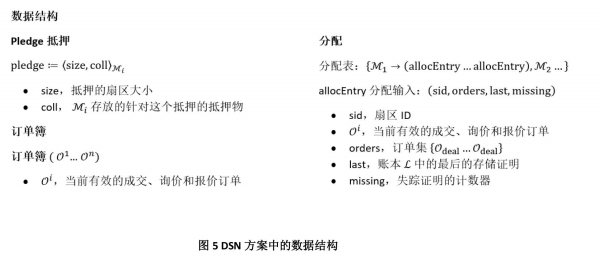
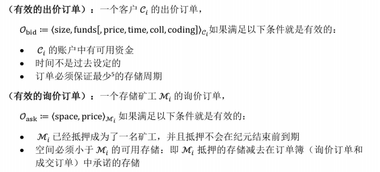

# Filecoin：一种去中心化的存储网络 

互联网正处于一场变革之中：中心化专门的服务将被去中心化的开放式服务所代替；信任机制将被可验证的计算代替；脆弱的路径地址将被弹性的内容地址代替；低效率大型服务器将被点对点算法市场所代替。比特币、以太坊和其他区块链的网络已经证明了去中心化交易账本的效用。这些公共账本可以运行一个复杂的智能合约，并且可以处理价值数百亿的加密资产。这些系统就是最开始的互联网开放式服务的先例，该系统中的参与者构成了一个去中心化的网络。该网络上在没有中心管理机制或者信任机制下提供有用的支付服务。IPFS通过本身自己去中心化的网页已经证明了内容可寻址的效用，它运行于全球的点对点对等网络中，为树十亿的文件提供服务。它把数据从孤岛中解放出来，解救了分片、离线和审查制度下的网络，并赋予数字信息永久性。

Filecoin是一个去中心化存储网络，它让云存储变成一个算法市场。这个市场运行在有着本地协议令牌（也叫做Filecoin）的区块链中。该市场上的矿工可以通过为客户提供存储来获取Filecoin,相反的，客户可以通过花费Filecoin来雇佣矿工来存储或分发数据。和比特币一样，Filecoin的矿工们也会相互竞争挖取带有巨大激励的区块，但Filecoin的挖矿能力是与积极的存储成比例的，这就会让矿工们直接去为客户提供有用的服务（不像比特币的挖矿仅是为了维护区块链的共识）。这种方式给矿工们创造了强大的激励，激励他们尽可能多的聚集存储器并且把它们出租给客户们。Filecoin协议将这些聚集的资源编织成世界上任何人都能依赖的自我修复的存储网络。该网络通过复制和分发内容实现其稳健性，同时还会自动检测和修复副本故障。客户可以挑选查看副本的参数来防范不同的威胁模型。该协议的云存储网络还提供了安全性，因为内容是在客户端端对端加密的，而存储提供者没有机会获得解密秘钥。Filecoin就像是在IPFS上加了一个激励层，它能够给任何数据提供存储基础设施。它对去中心化数据，构建和运行分布式应用程序，以及实现智能合同都非常有用。

## 1.介绍

Filecoin是一种协议令牌，其区块链运行在一种叫“时空证明”的新型证明机制上，里面的区块由存储数据的矿工生成。Filecoin协议通过一个存储提供者相互独立的网络来提供数据的存储和检索服务，这些提供者并不依靠一个单独的协调者。这个网络会发生：

* 用户为数据存储和检索支付令牌；
* 存储矿工通过提供存储空间赚取令牌；
* 检索矿工通过提供数据服务赚取令牌；

### 1.1 基本组件
Filecoin协议由四个新型组件组成

* 去中心化存储网络(Decentralized Storage Network)(DSN)：我们提出一个由提供存储和检索服务的独立服务商网络的抽象的概念（在第二节）。接着我们提出了将Filecoin协议作为一个可激励的、可审计的和可验证的DSN结构（在第4节）。
* 新型的存储证明：我们提出了两种新型存储证明方案（在第三节）：（1）“复制证明”（Proof-of-Replication）允许存储提供者证明数据已经被复制到了他自己唯一专用的物理存储设备上了。确保唯一的物理副本，使验证者能够去检查证明者有没有在保存到存储空间之前将数据的副本去重。（2）“时空证明”（Proof-of-Spacetime）允许存储提供商证明在指定的时间内存储了某些数据。
* 可验证的市场：在由Filecoin网络中，运行着两个去中心化的可验证的市场，我们在这两个市场上模型化的将存储请求和检索请求都作为订单（在第五节）。验证市场确保了当正确的提供了服务以后，酬金将会被支付。在我们提到的存储市场和检索市场上，矿工和用户分别会提交存储订单和检索订单。
* 有效的工作量证明（Proof-of-Work）：我们展示了如何基于“时空证明”来构建有效的工作量证明来应用于共识协议。矿工们不需要花费不必要的算力来挖矿，但相反的，他们必须在网络中存储数据。
  
### 1.2 协议概述

* Filecoin协议是一个去中心化存储网络建设，由一个区块链和其自带的令牌组建的。客户花费令牌来存储数据和检索数据，而矿工们通过提供存储和检索数据来赚取令牌。
* Filecoin DSN 分别通过两个可验证市场来处理存储请求和检索请求：存储市场和检索市场。客户和矿工设定所要求服务的价格和提供服务的价格，并将其订单提交到市场。
* 市场由Filecoin网络来操作，该网络采用了“时空证明”和“复制证明”来确保矿工们正确存储他们承诺存储的数据。
最后，矿工们都能参与区块链新区块的生成。矿工生成下一个区块的概率与他们在当前时刻网络中实际存储的数据量成正比。

### 1.3 论文组织
本文的其余部分安排如下：我们在第二节中介绍了对一个理论上的DNS方案的定义和需求。在第三节中我们定义和介绍我们的“复制证明”和“时空证明”协议，以及Filecoin将其用于加密地验证数据按照订单的要求被持续不断的存储。第四节描述了Filecoin DSN的具体实例，描述了数据结构，协议，以及参与者之间的交互。第5节定义和描述可验证市场的概念，还有存储市场和检索市场的实施。第6节描述了使用“时空证明”协议进行演示，并且评估矿工对网络的贡献，这对扩展区块链块和区块奖励是必要的。第7节简要介绍了Filecoin中的智能合约。在第8节中讨论了未来的工作作为结束。

## 2 去中心化存储网络的定义

我们介绍一下一个“去中心化网络存储”的概念，英文简称DSN。DSN体系聚集了由多个独立存储提供商提供的存储，并且能自我协调的提供存储数据和检索数据服务给客户。这种协调是去中心化的、无需信任的：通过协议的协调和个体参与者的验证操作，系统可以获得安全性操作。DSN体系可以使用不同的协调策略，包括拜占庭协议，gossip协议或者CRDTs，这取决于系统的需求。在后面，第四节，我们提供Filecoin DSN的的一个构建。

>定义 2.1
DSN方案(Π)是由存储提供者和客户运行的协议元组，包含:
(Put, Get, Manage)
Put(data) → key: 客户端利用一个唯一的标识密钥，执行Put协议，将数据保存。
Get(key) → data: 客户端使用密钥，执行Get协议，检索当前已经存储的数据。
Manage(): 网络通过管理协议来协调，实现：控制可用的存储，审核存储提供者提供的服务以及修复可能的故障。管理协议由存储提供者来运行，并且经常与客户或者审核网络结合（在管理协议依赖区块链的情况下，我们认为矿工是审核人员，因为他们验证和协调存储提供商）。

DSN体系(Π)必须保证数据的完整性和可恢复性，并且能够容忍在后面章节中所定义的管理和存储故障。

### 2.1 故障容错
**2.1.1 管理故障**

我们定义管理故障为拜占庭故障，是由在管理协议中的参与者造成的故障。一个DSN体系依赖于它的基础管理协议的故障容错。违反故障容错的管理故障假设会影响系统的活力和安全。

>例如，考虑一个DSN体系Π，其中管理协议要求使用拜占庭协议来审核存储提供者。在这样的协议中，网络收集到来自存储提供商的存储证明，并运行拜占庭协议对这些证明的有效性达成共识。如果在总共n个节点中，拜占庭协议最多容忍f个故障节点。那么我们的DSN可以容忍f<n/2 （？）个故障节点。在违反了这些假设的情况下，审核将会出现问题。

**2.1.2 存储故障**

我们将存储故障定义为拜占庭故障，它会阻止客户检索数据。例如存储矿工丢失了他们的数据碎片，或者检索矿工停止了他们的服务。一个成功的Put操作是：在(f,m)容错情况下,m个独立的存储提供者已经成功的存储了输入的数据，并且能够容忍最多f个拜占庭存储提供者。参数f和m取决于协议的实现。协议设计者可以修改f和m的值，或者留给用户自己修改。将Put(data) 扩展为Put(data,f,m)。如果有小于f个故障存储提供者，则对存储数据的Get操作是成功的。

>例如，考虑一个简单的方案。它的Put协议设计为每个存储提供者存储所有的数据。在这个方案里，m=n,并且f=m-1。但总是f=m-1吗，不一定的，有些方案可能采用可擦除式设计（erasure coding），其中每个存储提供者存储数据的特定部分，这样使得m个存储供应商中的x个需要检索数据，在这种场景下f=m-x。

### 2.2 属性
我们首先描述DSN体系所必须的两个属性，然后描述Filecoin DSN体系需要的另外的一些其他属性。

**2.2.1 数据完整性**

该属性要求不存在一个敌对节点A能够说服客户在执行Get命令后去接受那些被更改了的或被伪造的数据。

>定义 2.2
一个DSN方案(Π)提供了数据完整性：如果在使用密钥k的情况下，对数据d任意成功的Put操作，那就不存在敌手A能使得客户接受d’，因为使用密钥k执行Get命令后得到的d和d’不相同。

**2.2.2 可恢复性**

该属性满足了以下要求：给定我们Π中的容错假设，如果有些数据已经成功存储在Π中并且存储提供者继续遵循协议，那么客户最终能够检索到数据。

>定义 2.3
一个DSN体系(Π)提供可恢复性：如果利用密钥成功执行Put命令，将数据得以保存，那么也会存在用户使用相同的密钥成功执行Get命令，得到想要的副本数据。（这个定义并不保证每次Get操作都能成功，如果每次Get操作最终都能返回数据，那这个方案是公平的）。

### 2.3 其他属性
DSNs可以提供特定于其应用程序的其他属性。我们定义了Filecoin DSN所需要的三个关键属性：公开可验证性、可审查性和激励兼容性。

> 定义2.4
一个DSN方案(Π)是公开可验证的：对于每个成功的Put操作，存储网络的存储提供者可以生成数据当前正在被存储的证明。这个存储证明一定能说服任何只拥有私钥却没有数据的有效验证者。

> 定义2.5
一个DSN方案(Π)是可审查的：如果它产生了可验证的操作轨迹，那么在未来它被审查，可以证明在数据的有效时间内对数据的存储确实是真正的存储了。

>定义2.6
一个DSN方案(Π)是激励可兼容的：如果存储提供者由于成功提供了存储数据和检索数据的服务而获得激励，或者因为作弊而得到惩罚。所以存储提供者的明智策略就是去好好存储数据。

## 3 复制证明与时空证明
在Filecoin网络，存储提供者必须让他们的客户相信，客户所付费的数据已经被他们存储。在实践中，存储提供者将生成"存储证明"(POS)给区块链网络（或客户自己）来验证。在本小节，我们介绍和概述在Filecoin中所使用的“复制证明”n (PoRep)和“时空证明”(PoSt)实现方案。

### 3.1 动机

存储证明(POS)方案，比如“数据持有性验证”(PDP)[2]和“可恢复性证明”(PoR)[3,4]方案。它允许一个将数据外包给服务器（即证明人P)的用户（即验证者V)可以反复检查服务器是否依然存储数据D。用户可以用比下载数据还高效的方式来验证他外包给服务器的数据的完整性。服务器通过对一组随机数据块进行取样和提交小量数据来生成拥有的概率证明作为给用户的响应协议。

PDP和PoR方案只保证了证明人在响应的时候拥有某些数据。在Filecoin中，我们需要更强大的保障能阻止作恶矿工利用不提供存储却获得奖励的三种类型攻击：女巫攻击(Sybil attack)、外包攻击(outsourcing attacks)、生成攻击？（generation attacks）。

* 女巫攻击：作恶矿工可能通过创建多个女巫身份假装物理存储很多副本（从中获取奖励），但实际上只存储一次。
* 外包攻击：作恶矿工承诺可以存储比自己物理存储更多的数据，它会通过快速的从其他数据存储者那里获取数据来提供数据服务。
* 生成攻击：作恶矿工可能宣称要存储大量的数据，相反的他们使用小程序有效的生成请求，如果这个小程序小于所宣称要存储的数据，则作恶矿工在Filecoin获取区块奖励的可能性增加了，因为这是和矿工当前使用量成正比的。

### 3.2 复制证明

“复制证明”(PoRep)是一个新型的存储证明。它允许服务器（即证明人P)说服用户（即验证者V）一些数据D已被复制到它唯一的专用物理存储上了。我们的方案是一种交互式协议，其中证明人P:（a）承诺存储某数据D的n个不同的副本（独立物理副本），然后（b）通过响应协议来说服验证者V，P确实已经存储了每个副本。据我们所知PoRep改善了PDP和PoR方案，阻止了女巫攻击、外包攻击、代攻击。

请注意，正式的定义，它的属性描述，和PoRep的深入研究，我们参考了[5]

> 定义3.1
PoRep方案使有效的证明者P能够使验证者V确信P正在存储副本R，副本R是某些数据D的物理独立副本，同时也是P中唯一的副本。PoRep协议包含下边多项式时间算法：
(Setup, Prove, Verify)
* PoRep.Setup(1λ, D) → R, SP , SV , 其中SP和SV是P和V的方案特定的设置变量，λ是一个安全参数。PoRep.Setup用来生成副本R，并且给予P和V必要的信息来运行PoRep.Prove 和 PoRep.Verify。一些方案可能要求证明人或者是有互动的第三方去运算PoRep.Setup。
* PoRep.Prove(SP , R, c) → πc，其中c是验证人V发出的随机验证， πc是证明人产生的可以访问数据D的特定副本R的零知识证明。PoRep.Prove由P（证明人）为V运行，给V（验证者）生成πc。
* PoRep.Verify(Sv , c, πc) → {0, 1}，用来检测证明是否是正确。PoRep.Verify由V运行，并说服V自己相信P已经存储了R。

### 3.3 时空证明
存储证明（POS）方案允许用户在挑战（challenge）期间，检查存储提供者存储的外包数据是否正处于保存中。我们如何使用POS方案去证明数据在一定时间内一直处于被存储的呢？这个问题的答案就是，用户要不断地重复给存储提供者发起挑战。然而每次交互所需要的通信复杂度会成为系统（如Filecoin系统）的一个瓶颈，因为存储提供者被要求提交他们的证明到区块链网络。

为了回答这个问题，我们介绍了新的证明，“时空证明”，它可以让验证者检查存储提供商是否在一段时间内存储了他/她的外包数据。这对提供者的直接要求是：（1）生成顺序的存储证明（在我们的例子里是“复制证明”）来作为确定时间的一种方法 （2）递归地组合执行，从而产生一个简短的证明。

> 定义3.2
*（时空证明）PoSt方案使得有效的证明人P能够说服一个验证者V相信P在一段时间t内一直存储着一些数据D。PoSt包含下边多项式时间算法：
(Setup, Prove, Verify)
* PoSt.Setup(1λ,D)->Sp，Sv，其中SP和SV是P和V的特定方案的设置变量，λ是一个安全参数。PoSt.Setup用来给予P和V必要的信息来运行PoSt.Prove 和 PoSt.Prove。一些方案可能要求证明人或者是有互动的第三方去运算PoSt.Setup。
* PoSt.Prove(Sp , D, c, t) → πc，其中c是验证人V发出的随机挑战， πc是证明人在一段时间内可以访问数据D的的证明。PoSt.Prove由P（证明人）运行，并生成πc给V（验证者）。
* PoSt.Verify(Sv , c, t, πc) → {0, 1}，用来检测证明是否正确。PoSt.Verify由V运行并说服V自己相信P在一段时间内一直存储数据D。

### 3.4 PoRep和PoSt实际应用

我们感兴趣的是PoRep和PoSt的应用构建，可以应用于现存系统而不是依赖于可信任的第三方或者硬件。我们给出了PoRep的一个构建（请参见基于密封的复制证明[5]),它在Setup过程中需要一个非常慢的顺序计算密封的执行来生成副本。PoRep和PoSt的协议草图在图4给出，Post的底层体系的证明步骤在图3中。

**3.4.1 构建加密区块**

* 1.防碰撞散列： 我们使用一个防碰撞的散列函数：CRH : {0, 1}^* → {0, 1}^O(λ) 。我们还使用了一个防碰撞散列函数MerkleCRH，它将字符串分割成多个碎片，构造出二叉树并递归应用CRH，然后输出树根。
* 2.zk-SNARKs（零知识证明）： 我们的PoRep和PoSt的实际实现依赖于零知识证明（zk-SNARKs)[6,7,8]。因为zk-SNARKs是简洁的，所以证明信息简短并且很容易验证。更正式地，定义L为NP语言，C为L的决策回路。一个可信任的参与方执行一次setup时会产生两个公共密钥：证明密钥pk和验证密钥vk。证明密钥pk使任何（不可信）的证明者都能产生证明π，对于她选择的实例x，x∈L。非交互式证明π是零知识和知识证明。任何人都可以使用验证密钥vk验证证明π。特别是zk-SNARK的证明可公开验证：任何人都可以验证π，而不与产生π的证明者进行交互。证明π具有恒定的大小，并且可以被及时验证，即验证π在|x|中是线性的。

一个zk-SNARKs要满足C的多项式时间算法的元组是：
(KeyGen, Prove, Verify)

* KeyGen(1λ,C)→ (pk, vk)，输入安全参数λ和C，KeyGen产生概率样本pk和vk。这两个密钥作为公共参数发布，可在Lc 上用于证明/验证。
* Prove(pk, x, w) → π 在输入pk、x和NP声明见证w下，证明人执行Prove产生一个非交互的证明π，用来证明x ∈ Lc 这句话。
* Verify(vk, x, π) → {0, 1} 当输入vk，输入x和证明 π，如果满足x ∈ Lc ，则验证者执行Verify输出1。

我们建议感兴趣的读者参看[6，7，8]对zk-SNARK系统的正式介绍和实现。

通常而言这些系统要求KeyGen是由可信任参与方来运行。关于可扩展的计算完整性和私密性(SCIP)系统的新工作[9]显示了避免这个初始步骤的有希望的方向，因此才做出上面的信任假设。

**3.4.2 封装操作（Seal）**

封装操作的作用是
（1）通过要求证明者存储其公钥唯一的D的伪随机置换，来强制副本是物理上独立的副本，从而执行存储n个副本时，n个独立副本将被存储于磁盘空间中（因此是副本存储大小的n倍）
（2）在执行PoRep.Setup的时候，强制生成副本的时间要大大的长于预计响应挑战的预期时间。有关密封操作的更正式定义，请参见[5]。上述的操作可以用Seal^τ τAES−256 来实现，并且τ使得Seal^τ τAES−256 需要花费比诚实的“挑战-证明-验证”顺序多10-100倍的时间。

请注意，对τ的选择是重要的，这使得运行Seal^τ τAES−256 比证明人随机访问R花费更多时间显得更加明显。

**3.4.3 PoRep构建实践**

本节描述PoRep协议的构建，并总结了一个已在图4包括了的简单协议草图。实现和优化的细节略过了。

1.创建副本 Setup算法通过封装Seal算法生成一个副本并提供证明。证明人生成副本并将输出（不包括副本R)发送给验证者。

2.证明存储 Prove算法生成副本的存储证明。证明人收到来自验证者的随机挑战c，c指定了一个在根哈希为rt的默克树R中的叶子数据Rc 。证明人生成关于从树根rt到叶子Rc的路径的知识证明。

3.验证证明 Verify算法检查所给的源数据的哈希和副本的Merkle树根的存储证明的有效性。证明是公开可验证的：分布式系统的节点维护账本和对特定数据感兴趣的可以验证这些证明。

**3.4.4 PoSt构建实践**

本节描述PoSt协议的构建并已在图4中包含了一个简单协议草图。实现和优化的细节略过了。

Setup和Verify算法和上面的PoRep构建是一样的。所以我们这里值描述Prove。

1.空间和时间的证明 Prove算法为副本生成“时空证明”。证明人接收到来自于验证者的随机挑战，并顺序生成”复制证明“，然后使用证明的输出作为另一个输入做指定t次迭代.

### 3.5 在Filecoin的应用
Filecoin协议采用”时空证明“来审核矿工提供的存储。为了在Filecoin中使用PoSt，因为没有指定的验证者，并且我们想要任何网络成员都能够验证，所以我们把方案改成了非交互式。因为我们的验证者是在public-coin模型中运行，所以我们可以从区块链中提取随机性来发出挑战。

## 4 Filecoin:一个DSN架构 

Filecoin DSN是可审核的，可公开验证和激励式设计的去中心化的存储网络。客户为了存储数据和检索数据向矿工网络付费。矿工提供磁盘空间和带宽来赚取费用。矿工只有在网络通过了他们的服务是否正确的审核后，才会收到付款。

### 4.1 环境
**4.1.1 参与者**

任何用户都可以作为客户端、存储矿工、检索矿工或存储兼检索矿工来参与Filecoin网络。

* 客户在DSN中通过Put和Get请求存储数据或者检索数据，并为此付费。
* 存储矿工为网络提供数据存储。存储矿工通过提供他们的磁盘空间和响应Put请求来参与Filecoin。要想成为存储矿工，用户必须按照存储空间的大小预存对应的抵押品。存储矿工响应客户Put请求，将客户的数据储存，并且储存的有效时间是明确的。存储矿工生成"时空证明”，并提交到区块链网络来证明他们在特定时间内存储了数据。假如证明无效或丢失，那存储矿工将被罚没他们的部分抵押品。存储矿工也有资格挖取新区块，如果挖到了新块，矿工就能得到挖取新块的奖励和包含在块中的交易费。
* 检索矿工为网络提供数据检索服务。检索矿工通过提供用户Get请求所需要的数据来参与Filecoin。和存储矿工不同，他们不需要抵押，不需要提交存储数据，不需要提供存储证明。存储矿工可以同时也作为检索矿工参与网络。检索矿工可以直接从客户或者从检索市场赚取收益。

**4.1.2 网络**

我们将所有运行Filecoin全节点的所有用户称之为一个抽象实体：网络。该网络作为运行管理协议的中介。简单的说，负责Filecoin区块链的每个新块生成,全节点管理可用的存储，验证抵押品，审核存储证明和修复可能的故障。

**4.1.3 账本**

我们的协议适用于基于账本的货币。为了通用，我们称之为“账本” L。在任何给定的时间t(称为时期)，所有的用户都能访问Lt。当处于时期t的时候，账本是追加式的，它由顺序的一系列交易组成。Filecoin DSN协议可以在运行验证Filecoin的证明的任意账本上实现。在第六节中我们展示了我们如何基于有用的工作构建一个账本。

**4.1.4 市场**

存储需求和供给组成了两个Filecoin市场：存储市场和检索市场。这两个市场是两个去中心化交易所，这会在第5节中详细解释。简而言之，客户和矿工们通过向各自的市场提交订单来设定他们请求服务或者提供服务的订单的价格。交易所为客户和矿工们提供了一种方式来查看匹配出价并执行订单。如果服务请求被成功满足，通过运行管理协议，网络保证了矿工得到报酬，客户将被收取费用。

## 4.2 数据结构

* 碎片是客户在DSN所存储数据的一部分。例如，数据是可以任意划分为许多片，并且每片都可以有不同集合的存储矿工来存储。
* 扇区是存储矿工向网络提供的一些磁盘空间。矿工将客户数据的碎片存储到扇区，并通过他们的服务来赚取令牌。为了存储碎片，矿工们必须向网络抵押他们的扇区。
* 分配表是一种数据结构，可以跟踪碎片和其分配的扇区。分配表在账本的每个区块都会更新，Merkle根存储在最新的区块中。在实践中，该表用来保持DSN的状态，它使得在证明验证的过程中可以快速查找。更详细的信息，请参看图5。
* 订单式请求或提供服务的意向声明。客户向市场提交投标订单来请求服务（存储数据的存储市场和检索数据的检索市场），矿工们提交报价订单来提供服务。订单数据结构如图10所示。市场协议将在第5节详细介绍。
* 订单簿是订单的集合。请查看第5.2.2节的存储市场订单簿和第5.3.3节的检索市场订单簿。
* 抵押是向网络提供存储（特别是扇区）的承诺。存储矿工必须将抵押提交给账本，以便能在存储市场接受订单。抵押包括了抵押扇区的大小和存储矿工已存入的抵押品。

## 4.3 协议

在本节中，我们通过描述客户端、矿工和网络执行的操作来概述Filecoin DSN。我们在图7中介绍了Get和Put协议的方法，和在图8中的管理协议。一个协议执行的示例如图6所示。图1是Filecoin协议概览。

**4.3.1 客户生命周期**

我们给出客户生命周期的概览：在第5节接下来的协议会做深度的解析。

* 1.Put：客户将数据存储于Filecoin
   * 客户可以通过向Filecoin中的矿工支付令牌来存储他们的数据。第5.2节详细介绍了Put协议。
   * 客户通过向存储市场订单薄递交一个订单（bid order）来发起Put协议。当发现一个匹配的矿工询价订单（ask order）时，客户会将要存储的数据碎片发送给该矿工。双方都会在成交单（deal order）上签字，并将该deal递交到存储市场的订单博中。
   * 客户应该能够通过提交多个订单来决定他们文件碎片物理副本的数量（或者指定订单中的副本复制因子）。更高的文件冗余程度会保证更高的存储容错程度。

* 2.Get：客户从Filecoin检索数据。
   * 客户可以通过使用Filecoin 令牌向检索矿工付费来检索任何数据。Get协议在第5.3节有详细描述。客户端通过执行Get协议向检索市场订单簿提交投标订单（bid order）。当找到匹配的矿工报价订单后，客户会收到来自矿工的碎片。当收到的时候，双方对成交订单（deal order）进行签名并提交到区块链来确认交易成功。

**4.3.2 挖矿过程(针对存储矿工)**

我们给出一个非正式的挖矿周期概述。

* 1.抵押：存储矿工向网络抵押存储。
  * 存储矿工通过存入抵押品（通过区块链中的抵押交易存入的，方法是Manage.PledgeSector）来将自己的存储抵押到网络中的。这个抵押品是准备要给网络提供服务时存入的，并且如果矿工生成了它提交存储的文件的存储证明，抵押品是被返还的。但如果生成的一些存储证明是有问题的，那么一定比例的抵押品将会被扣除。
  * 一旦抵押交易在区块链中出现，矿工就能在存储市场中提供他们的存储服务：设定自己的报价，并在市场的订单簿添加自己的ask询价订单。

2.接收订单：存储矿工从存储市场获取存储请求。
一旦抵押交易出现在区块链中(AllocTable列表中)，矿工就能在存储市场中提供他们的存储服务：设定自己的报价，并在市场的订单簿添加自己的ask询价订单，通过方法Put.AddOrders实现。

通过Put.MatchOrders 来检查是否和客户的报价订单匹配一致。

一定订单匹配，客户会将他们的数据发给存储矿工。存储矿工接收到数据的时候，运行Put.ReceivePiece 。数据被接收完之后，矿工和客户对成交订单上签字，并将其提交到区块链。

3.封装：存储矿工为未来的证明准备碎片。

存储矿工的存储切分为扇区，每个扇区包括了分配给矿工的碎片。网络通过分配表来跟踪每个存储矿工的扇区。当存储矿工的扇区填满了，这个扇区就被密封起来。密封是一种缓慢的顺序操作。将扇区中的数据转换成为副本，然后将数据的唯一物理副本与存储矿工的公钥相关联。在“复制证明”期间密封操作是个必要的操作。如下所述在第3.4节。

4.证明：存储矿工证明他们正在存储所承诺的碎片（数据）。

当存储矿工被分配数据时，他们必须重复地生成复制证明以保证他们正在存储数据（有关更多详细信息，请参看第3节）。证明发布在区块链中，并由网络来验证。

**4.3.3 挖矿周期（针对检索矿工）**

我们给出一个非正式的挖矿周期概述。

1.收到订单：检索矿工从检索市场得到获取数据的请求。

检索矿工在网络中通过gossip协议广播他们的ask询价报单来宣布他们的碎片：他们设置报价，并将询价报单添加到市场的订单簿中。

2.发送：检索矿工向客户发送数据碎片。

一旦订单匹配，检索矿工就将数据发送给客户（第5.3节有详细描述）。当数据碎片被接收以后，矿工和客户双方都在完成的成交订单上签字，并将其提交到区块链上。

**4.3.4 网络周期**

我们给出一个非正式的网络操作概述。

1.分配：网络将客户的碎片分配给存储矿工的扇区。

客户通过向存储市场提交报价订单来启动Put协议。（存储订单通过区块链提交，详见5部分）。
当询价订单和报价订单匹配的时候，参与的各方共同履行交易并向市场提交成交的订单。此时，网络将数据分配给矿工，并将其记录到分配表中。

2.修复：网络发现故障并试图进行修复

所有的存储分配对于网络中的每个参与者都是公开的。对于每个块，网络会检查每个需要的证明都存在，检查它们是否有效，因此采取行动：

* 1)如果有任何证明丢失或无效，网络会通过扣除部分抵押品的方式来惩罚存储矿工。
* 2)如果大量证明丢失或无效（由系统参数Δfault定义），网络会认定存储矿工存在故障，将订单设定为失败，并将同样的数据引入到新订单进入市场。
* 3)如果所有存储该数据的存储矿工都有故障，则该数据丢失，客户获得退款。

### 4.4 担保和要求
以下是Filecoin DSN如何实现完整性、可检索性，公开可验证性和激励兼容性的总结。

* 实现完整性 数据碎片以加密哈希命名。一个Put请求后，客户只需要存储哈希即可通过Get操作来检索数据，并可以验证收到的数据的完整性。
* 实现可恢复性 在Put请求中，客户指定副本因子和渴望的纠删码技术类型。假设给定的m个存储矿工存储数据，可以容忍最多f个故障，则该方式是(f, m)-tolerant存储。通过在不同的存储提供者存储数据，客户端可以增加恢复的机会，以防存储矿工下线或者消失。
* 实现公开可验证和可审核性 存储矿工需要提交其存储 (πSEAL, πPOST)的证明到区块链。网络中的任意用户都可以在不访问外包数据的情况下验证这些证明的有效性。另外由于这些证明都是存储在区块链上的，所以操作痕迹可以随时审核。
* 实现激励兼容性 不正式的说，矿工通过提供存储而获得奖励。当矿工承诺存储一些数据的时候，它们需要生成证明。如果矿工忽略了证明就会被惩罚（通过损失部分抵押品），并且不会收到存储的奖励。
* 实现保密性 如果客户希望他们的数据被隐私存储，那客户必须在数据提交到网络之前先进行加密。

## 5 Filecoin的存储和检索市场

Filecoin有两个市场：存储市场和检索市场。这两个市场的数据结构相同，但是采用了不同的设计原理。存储市场允许客户支付给存储矿工费用并让其存储自己的数据。检索市场允许客户支付给检索矿工费用并让其从网络中传送数据给自己。这两种情况，客户和矿工都可以设置他们请求和需求价格，或者接受当前的请求。他们之间的交易都通过网络运行，该网络是一个在Filecoin链上的全节点网络。这个网络可以保障矿工当提供服务时从客户那里获得酬金。

### 5.1 可验证市场（Verifiable Markets）
交易市场（Exchange Markets）是促进特定商品和服务交换的协议。它们使得买家和买家促成交易。为达成我们的目的，我们要求交易是可验证的：参与者的去中心化网络必须能够验证买家和卖家之间的交易。

我们提出验证市场的概念。它没有单一的实体来管理交易，交易是透明的，任何人都可以匿名参与。可验证市场协议通过去中心化的方式操作商品/服务的交易：订单簿和订单结算的一致性，服务的正确执行由参与者独立的进行验证-在FileCoin案例中，是矿工和全节点进行验证。我们简化可验证市场来进行以下构建：

> 定义5.1
可验证市场是一个有两个阶段的协议：订单匹配和结算。订单是购买意向或者出售商品或服务的声明，订单簿就是所有可用订单的列表。

可验证市场协议：
* 订单匹配：
  * 参与者们在订单簿中添加购买订单和出售订单；
  * 当这两个订单匹配时，双方会共同地创建一个成交订单（deal order），该订单使买卖双方达成交易。双方还会通过将成交订单添加到订单簿中，来实现广播成交订单到网络中。

* 结算：
  * 网络要确保商品或服务的传输已经被正确执行，要求卖家对他们的交易和服务生成加密的证明。
  * 一旦成功，网络将会执行支付，并在订单簿中清除这些完成的订单。

### 5.2 存储市场
存储市场是可验证的市场，它允许客户（即买家）请求存储他们数据，而存储矿工（即卖家）将会提供他们的存储空间。

**5.2.1 需求**

我们根据以下需求来设计存储市场协议：

* 链上订单簿（In-chain orderbook） 重要的是（1）存储矿工的订单是公开的，所以最低价格的订单总是网络可知的，客户可以对订单做出明智的决定（2）客户订单必须始终提交给订单簿，即使当他们接受了最低的价格，这样市场就可以对新的报价做出反应。因此我们要求订单添加到Filecoin区块链，为的是能被加入订单簿。
* 参与者投入资源：我们要求参与双方将他们的资源做出承诺，以此来避免损害：避免存储矿工不提供服务和避免客户没有可用的资金。为了能参与存储市场，存储矿工必须要进行抵押，在DSN网路中存入一些抵押品，抵押品的数量根据他们已存储数据的量对应的比例而定（更多详细信息请参看第4.3.3节）。通过这种方式，网络可以惩罚那些承诺存储数据但又不提供存储证明的存储矿工。同样的，客户必须向订单充入特定数量的资金，以这种方式保证在结算期间的资金可用性。
* 故障自管理： 只有在存储矿工反复证明他们已经在约定的时间内存储了数据的情况下，订单才会结算给矿工。网络必须能够验证这些证明的存在性和正确性并且根据4.3.4部分提到的修复规则运行自修复处理。

**5.2.2 数据结构**

* Put订单 有三种类型的订单：出价订单，询价订单和成交订单。存储矿工创建询价订单添加存储，客户创建出价订单请求存储，当双方对价格达成一致时，他们共同创建成交订单。订单的数据结构和订单参数的明确定义如图10所示。

* Put订单簿 存储市场的订单簿是目前有效和开放的询价，出价和成交订单的集合。用户可以通过Put协议中定义的方法与订单簿进行交互：AddOrders,MatchOrders如图7所示。

订单簿是公开的，并且每个诚实的用户都有同样的订单簿视图。在每个周期，如果新的订单交易出现在新的区块中，那么该订单将被添加到订单簿中。如果订单被取消，失效或者结算，则会被清除。如果订单是有效的，他们将被添加到区块链中，也就是在订单簿中：

> 定义5.2 我们定义出价，询价，成交订单的有效性：
> 

**5.2.3 存储市场协议**

简而言之，存储市场协议分为两个阶段：订单匹配和结算：

* 订单匹配：客户端和存储矿工通过提交交易到区块链来将订单提交到订单簿（步骤1）。当订单匹配时，客户端发送数据碎片给存储矿工，双方签署成交订单并提交到订单簿（步骤2）。

* 结算：存储矿工封装扇区（步骤3a），生成扇区所包含的碎片的存储证明，并将其定期提交到区块链（步骤3b)；同时，其余的网络必须验证矿工生成的证明并修复可能的故障（步骤3c）。

### 5.3 检索市场

检索市场允许客户端请求检索特定的数据，由检索矿工提供这个服务。与存储矿工不同，检索矿工不要求在特定时间周期内存储数据或者生成存储证明。在网络中的任何用户都可以成为检索矿工，通过提供检索服务来赚取Filecoin令牌。检索矿工可以直接从客户端或者检索市场那里获取碎片，也可以存储它们成为存储矿工来提供碎片。

**5.3.1 需求**

我们根据以下的需求来设计检索市场协议：

* 链下订单簿 客户必须能够找到提供所需要数据碎片的检索矿工，并且在定价之后直接交易获得数据碎片。这意味着订单簿不能通过区块链来运行-因为这将成为快速检索请求的瓶颈。相反的，参与者只能看到订单簿的部分视图。我们要求双方传播自己的订单。
* 无信任方检索 公平交换的不可能性[10]提醒我们双方不可能在没有信任方的支持下进行交易。在存储市场中，区块链网络作为去中心化信任方来验证存储矿工提供的存储。在检索市场，检索矿工和客户在没有网络见证所交换文件的情况下来交换数据。我们通过要求检索矿工将数据分割成多个碎片并将每个碎片发送给客户来达到这个目的，矿工们将收到付款。在这种方式中，如果客户停止付款，或者矿工停止发送数据，任何一方都可以终止这个交易。注意的是，我们必须总是假设总是有一个诚实的检索矿工。
* 支付通道 客户当提交付款的时候可以立即进行检索感兴趣的碎片。检索矿工只有在确认收到付款的时候才会提供数据碎片。通过公共账本来确认交易可能会成为检索请求的瓶颈，所以，我们必须依靠有效的链下支付。Filecoin区块链必须支持快速的支付通道，实现快速和圆满的交易。仅在出现纠纷的情况下才使用区块链进行支付。通过这种方式，检索矿工和客户端可以快速发送Filecoin协议所要求的小额支付。未来的工作里包含了创建一个如[11,12]所述的支付通道网络。

**5.3.2 数据结构**

* 获取订单 检索市场中包含有三种类型的订单：客户创建的出价单 Obid，检索矿工创建的询价单Oask，和存储矿工和客户达成的成交订单Odeal。订单的数据结构如图10所示。

* 获取订单簿 检索市场的订单簿是有效的和公开出价订单、询价订单和成交订单组成的集合。与存储市场不同，每个用户有不同的订单簿视图，因为订单是在网络中传播的，每个矿工和客户只会跟踪他们所感兴趣的订单。

**5.3.3 检索市场协议**

简而言之，检索市场协议分为两个阶段：订单匹配和结算：

* 订单匹配 客户端和检索矿工通过广播将订单提交给订单簿（步骤1）。当订单匹配的时候，客户端和检索矿工建立小额支付通道（步骤2）。

* 结算 检索矿工发送小部分的碎片给到客户端，然后对每个碎片客户端会向矿工发送收妥的收据receipt（步骤3）。检索矿工向区块链出示收据从而获得奖励（步骤4）。

## 6 有效的工作共识
Filecoin DSN协议可以在任何一致性协议（允许FileCoin网络的证明的验证）的基础上实现。在本小节，我们介绍如何基于有用的工作引入一致性协议。Filecoin网络中的矿工通过生成时空证明，而不是浪费资源的PoW算法，来参与共识。

有用 如果计算的输出对网络来说是有价值的，而不仅仅是为了保证区块链的安全。我们认为矿工在共识协议中所作的工作是有用的.

### 6.1 动机
确保区块链的安全是至关重要的。POW的证明方案往往是用一个不可重复的方法解决一个难题或者需要大量的浪费计算才能找到难题的解决方案。

不可重复利用的工作 大多数无许可型的区块链要求矿工解决很难的计算难题，比如反转哈希函数。通常情况下这些解决方案都是无用的，除了保护网络安全之外，没有其他任何价值。我们可以重新设计让这件事有用吗？

* 尝试重复使用的工作：已经有几个重复使用挖矿算力进行有用的计算的尝试。一些努力方面是要求矿工在标准Proofof-Work的同时执行特殊的计算。另外的方向是用另一套解决有用的问题机制来代替PoW，但是至今很难实现。举个例子，Primecoin重复利用矿工的算力去寻找新的prime数量；Ethereum要求矿工在执行POW是还要执行一些小程序；Permacoin要求矿工提供档案服务，矿工当证明数据已经被存档时还要生成一个hash；尽管很多尝试实现了有效工作，但是浪费的工作量仍然是这些计算中的普遍因素。

无效工作 解决数学难题在机器成本和电力消耗方面是非常昂贵的，特别是如果这些难题完全依赖计算能力。当挖矿算法不能并发的时候，那解决难题的普通因素就是计算的算力。我们可以减少无效的工作吗？

* 试图减少浪费：理想情况下，大部分网络资源应该花费在有用的工作上。一些尝试是要求矿工使用更节能的解决方案。例如，“空间挖矿”（？Spacemint）要求矿工致力于磁盘空间而不是计算；虽然更加节能，但磁盘空间依然”浪费“，因为它们被随时的数据填满了。其他的尝试是用基于权益证明的传统拜占庭协议来代替难题的解决，其中利益相关方在下一个块的投票与其在系统中所占有的货币份额成正比。

我们着手设计一个基于用户数据存储的有用工作的共识协议。

### 6.2 Filecoin 共识
我们提出一个有效工作的一致性协议，选举产生一个矿工去产生新的区块，被选举出来的概率和它当前在网络中已经存储的数据（正在被应用中的数据）占全网数据存储的比例有很大关系。我们设计Filecoin协议，使矿工更愿意投资存储而不是算力，从而达到并行化挖矿计算。矿工提供存储和重新使用计算来证明数据被存储以参与共识。

**6.2.1 模型化挖矿存力**

存力容错 在我们的技术报告[13]中，我们提出了存力容错，这是对在参与者对协议结果的影响方面重新构建拜占庭故障的抽象。每个参与者控制了网络总存力n中的一部分存力，其中f是故障节点或作恶节点所控制的存力占比。

Filecoin存力在Filecoin网络中，在时刻t，矿工Mi的存力P^t i是矿工Mi所有有效存储的总和。Mi的I^t i是网络中Mi总存力的影响因子。

在Filecoin中，存力有以下属性：

* 公开：网络中当前正在使用的存储总量是公开的。通过读取区块链，任何人都可以计算每个矿工的存储量-因此任何人都可以计算出在任意时间点的每个矿工的存力和网络总存力。

* 可公开验证的：对于每个存储任务，矿工都需要生成”时空证明“，证明持续提供服务。通过读取区块链，任何人都可以验证矿工的能力声明是否是正确的。

* 可变的：在任何时候，矿工通过抵押一个新扇区并对该扇区进行数据填充的方式，可以添加一个新的存储到网络中。通过这种方式，矿工们可以通过时间改变他们的存储总量。

**6.2.2 用时空证明保障数据的安全性**

每个∆proof 区块（∆proof是系统参数），矿工们都必须向网络提交“时空证明”，如果网络中大多数算力认为它们是有效的，才会被成功添加到区块链中。在每个区块中，每个全节点会更新分配表（AllocTable），添加新的存储分配、删除过期的和标记缺少证明的记录。可以通过对分配表的记录来对矿工Mi的能力进行计算和验证。这些可以通过两种方式来完成：

* 全节点验证：如果节点拥有完整的区块链记录，则可以从创始块开始运行网络协议直到当前区块，并读取矿工Mi的AllocTable。这个过程中验证了每一个Mi存储的“时空证明”。

* 简单存储验证：假设轻客户端可以访问广播最新区块的信任源。轻客户端可以从网络中的节点请求：
  * （1）Mi在当前分配表中的记录 
  * （2）该记录被包含在最新区块的状态树中的Merkle路径
  * （3）从创世块到当前区块的区块头。

这样轻客户端就可以将“时空证明”的验证委托给网络。

存力计算的安全性来自于“时空证明”的安全性。在这个设置里面，Post保证了矿工无法对他们所分配的存储数量说谎。事实上，他们不能声称能够存储超过他们的存储空间的数据，因为这会花费时间来运行PoSt.Setup，另外PoSt.Prove是串行的计算，并不能并行化的快速生成证明。

**6.2.3 使用存力达成共识**

我们通过扩展现有的（以及未来的）权益证明一致性协议，预料实现Filecoin协议会有多重的策略，其中股权会被已完成的存储代替。我们预计了权益证明协议的改进，同时也提出了一个基于我们称为预期共识的前期工作的构建[14]。我们的策略是在每一轮选举出一个（或多个）矿工，如此这样矿工赢得选举的概率与他们分配的存储成比例。

预期共识（Expected Consensus） 预期共识的基本直觉是确定性的、不可预测的。并在每个周期内秘密选举一个小的Leader集合。预期的期望是每个周期内当选的Leader是1个，但一些周期内可能有0个或者许多个Leader。Leader们通过创建新区块并广播来扩展区块链网络。在每个周期，每个区块链被延伸一个或多个区块。在某个无Leader的周期内，空区块被添加到区块链中。虽然链中的区块可以被线性排序，但其数据结构是有向无环图。EC是一个概率共识，每个周期都使得比前面的区块更加确定，最终达到了足够的确定性，且出现不同的历史块链的可能性是足够小的。如果大多数的参与者都通过签署区块链来扩展区块链，加大这个区块所属链的权重，那么这个区块就被确认了。

选举矿工 在每个周期，每个矿工检查他们是否被选为Leader，这类似于完成前面的协议:CoA[15],Snow White[16]，和Algorand[17]。

在图13中，我们描述了矿工（ProveElect）和网络节点（VerifyElect）之间的协议。这种选举方案提供了三个属性：公平，保密和公开的可验证性。

* 公平 每个参与者每次选举只有一次试验，因为签名是确定性的，而且t和rand(t)是固定的。假设H是安全的加密散列函数，则H(Mi)/2L必须是从（0，1）均匀选择的实数，因此，可能使得方程等式为true必须是Pti/Σjptj，这等于矿工在在网络中的能力占的比重。因为这个概率在能力上是线性的，这种可能性在分裂或者汇集能力情况下被保留。注意随机值rand(t)在时刻t之前是未知的。

* 保密 由于有能力的攻击者不拥有Mi用来计算签名的秘钥，考虑到数字签名的假设，这个是可以忽略不计的。

* 公开可验证： 当选Leader i ∈ Lt 可以通过给出t，rand(t)，H(i)/2L，来说服一个有效的验证者。鉴于前面的观点，在没有密钥的情况下，没有敌手能够生成一个证明。

## 7 智能合约
Filecoin为最终用户提供了两个基本命令：Get和Put。 这两个命令允许客户以优惠的价格存储数据并从市场中检索数据。 尽管命令涵盖了Filecoin的默认使用案例，但我们通过支持智能合约的部署，允许在Get和Put之上设计更复杂的操作。用户可以编写新的严谨的存储/检索的请求，我们就像归类一般的智能合约一样将其归类为文件合约。我们整合了一个合约系统（基于[18]）和一个桥系统，目的是将Filecoin存储装入其他区块链，反之亦然，将其他区块链的功能带入Filecoin。

我们期望在Filecoin生态系统中存在大量的智能合约，我们期待着一个智能合约开发者社区。

### 7.1 Filecoin智能合约
智能合约使得Filecoin的用户可以编写有状态的程序，来花费令牌向市场请求存储/检索数据和验证存储证明。用户可以通过将交易发送到账本触发合约中的功能函数来与智能合约交互。我们扩展了智能合约系统来支持Filecoin的特定操作（如市场操作，证明验证）。

* 文件合约：我们允许用户对他们提供的存储服务进行条件编程。有几个例子值得一提：（1）承包矿工：客户可以提前指定矿工提供服务而不参与市场 （2）付款策略：客户可以为矿工设计不同的奖励策略，例如合约可以给矿工支付随着时间的推移越来高的费用 ，另一个合约可以由值得信任的Oracle的通知来设置存储的价格。（3）票务服务：合约可以允许矿工存放令牌和用于代表用户的存储/检索的支付 （4）更复杂的操作：客户可以创建合约来运行数据更新。

* 智能合约：用户可以将程序关联到其他系统（如以太坊[18]）他们的交易上,他们不直接依赖存储的使用。我们可以预见应用程序如：去中心化命名服务，资产跟踪和预售平台。

### 7.2 与其他系统的集成
桥（Bridges）是旨在连接不同区块链的工具；现在正在处理中的，我们计划支持跨链交互，以便能将Filecoin存储带入其他基于区块链的平台，同时也将其他平台的功能带入Filecoin。

* Filecoin进入其他平台：其他的区块链系统，如比特币[19]，Zcash [20]，特别是Ethereum [18]和Tezos，允许开发人员写智能合约；然而，这些平台只提供很少的存储能力和非常高的成本。我们计划提供桥将存储和检索支持带入这些平台。我们注意到，IPFS已经被应用到一些智能合约中，来实现内容引用和分发的功能。增加到Filecoin的支持将允许这些系统以交换Filecoin令牌的方式来保证IPFS存储内容。
* 其他平台进入Filecoin：我们计划提供Filecoin连接其他区块链服务的桥。例如，与Zcash的集成将支持发送隐私数据的存储请求。

## 8 未来的工作
这项工作为Filecoin网络的建设提供了一个清晰和凝聚的道路;但是，我们也认为这项工作将成为今后研究去中心化存储系统的起点。在这个我们识别和填充三类未来工作。这包括已经完成只是等待描述和发布的工作，提出改进当前协议的开放式问题，和协议的形式化。

### 8.1 正在进行的工作
以下内容代表正在进行的工作。

* 每个块中的Filecoin状态树的规范。
* Filecoin及其组件的详细绩效评估和基准。
* 完全可实现的Filecoin协议规范。
* 赞助检索票务模型，其中通过分配每个可持票花费的令牌，任何客户端C1可以赞助另一个客户端C2的下载。
* 分层共识协议，其中Filecoin子网可以在临时或永久分区进行分区并继续处理事务。
* 使用SNARK / STARK增量区块链快照。
* FileCoin-Ethereum合约接口和协议。
* 使用编织（Braid？）进行区块链归档和区块链间冲压。
* 只有在区块链解决冲突的时候才发布"时空证明”。
* 正式证明实现了Filecoin DSN和新型存储证明。

### 8.2 开放式问题
作为一个整体，有一些公开的问题，其答案有可能可以大大改善网络。尽管事实上，在正式启动之前并不是必须解决的问题。

* 一个更好的原始的"复制证明“封装功能，理想情况下是O（n）解码（不是O（nm）），可公开验证，无需SNARK / STARK。
* 用于复制证明功能的更好的命令，它可以在没有SNARK / STARK的情况下可以公开验证和透明。
* 一个透明，可公开验证的可检索证明或其他存储证明。
* 在检索市场中进行检索的新策略（例如，基于概率支付，零知识条件支付）。
* “预期共识”更好的秘密Leader选举，在每个周期，只有一位当选Leader。
* 更好的可信赖的SNARK设置方案，允许增加扩展公共参数（可以运行MPC序列的方案，其中每个附加的MPC严格降低故障概率，并且每个MPC的输出可用于系统）。

### 8.3 证明和正式的验证
由于证明和正式验证的明确价值，我们计划证明Filecoin网络的许多属性，并在未来几个月和几年内开发正式验证的协议规范。几个证明正在进行中还有些正在思考中。但注意，要证明Filecoin的许多属性（如伸缩，离线）将是艰难的，长期的工作。

* 预期共识和变体的正确性证明。
* 功率故障容错正确性的证明，异步1/2不可能导致分叉。
* 在通用组合框架中制定Filecoin DSN，描述Get，Put和Manage作为理想的功能，并证明我们的实现。
* 自动自愈保证的正式模型和证明。
* 正式验证协议描述（例如TLA +或Verdi）。
* 正式验证实现（例如Verdi）。
* Filecoin激励的游戏理论分析。